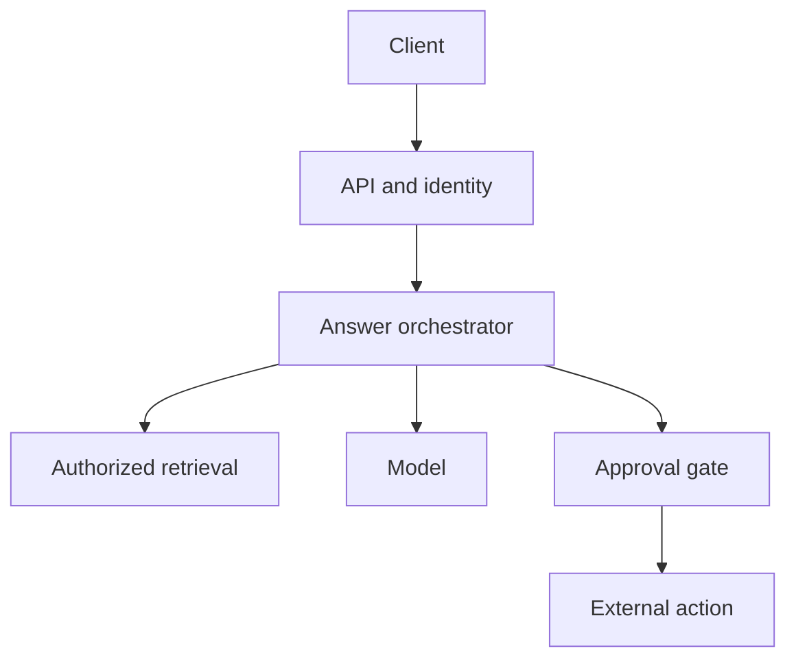

# 01 — Requirements and capacity

## Mental model

A system design is a set of promises under constraints. **Functional requirements** describe what users can do; **quality requirements** describe latency, availability, correctness, security, freshness, and cost. Choose components only after bounding those promises.

Ask first: Who uses the system? What are the top two operations? What data enters and leaves? Who may see or change each record? What happens when a dependency fails?

## Running example

An operations assistant lets a project manager ask about an invoice or RFI. It returns a cited answer using records the manager may access. A proposed invoice approval requires confirmation from an authorized human before any external system changes.

**Scope:** interactive questions and approved actions. **Outside this design pass:** training a foundation model or replacing the source ERP.

## Set measurable targets

These are exercise assumptions, not observed production numbers:

| Dimension | Assumption | Design consequence |
| --- | --- | --- |
| Traffic | 1,000 organizations × 100 active users × 10 questions/day | Estimate average demand |
| Peak | 10× average | Plan initial capacity |
| Response | Complete cited answer in under 5 seconds at p95 | Set an end-to-end budget |
| Correctness | No cross-tenant access; actions require approval | Check identity at data and action boundaries |
| Availability | 99.9% monthly for reads | Define degraded behavior |
| Freshness | Records searchable within 5 minutes | Design ingestion and indexing |

Specify exactly where latency starts and ends, whether errors count, and which user group the SLO covers.

## Estimate demand

100,000 active users × 10 questions = **1,000,000 questions/day**. Average rate = 1,000,000 / 86,400 ≈ **11.6 requests/second**. A 10× planning peak is ≈ **116 requests/second**.

An initial concurrency estimate is request rate × average request duration (Little's Law under stable conditions). If requests average 3 seconds at peak, about **348 in-flight requests** are expected. Do not substitute p95 latency for mean duration; measure the distribution and burst shapes.

Storage requires documents/day × mean bytes × retention, then index and replica overhead. Model cost requires input tokens, output tokens, cache hit rate, and routing mix. Keep missing variables explicit.

### Draft latency budget

| Stage | Budget |
| --- | ---: |
| Authentication and authorization | 150 ms |
| Retrieval and record fetch | 700 ms |
| Reranking and context assembly | 350 ms |
| Model generation | 3,200 ms |
| Network and contingency | 600 ms |

The budgets sum to 5 seconds, but adding each stage's p95 does **not** determine the end-to-end p95. Measure full requests and correlated tail latency.

## First architecture

Enforce tenant and record permissions before content reaches the model. Recheck authorization and current state when executing a proposed action. A citation identifies source material; it does not prove the answer's reasoning is correct.

## Tradeoffs and failure modes

- **Freshness versus cost:** Faster indexing uses more resources. If a just-edited invoice must appear immediately, read the authoritative source when appropriate.
- **Latency versus quality:** More context or longer output increases time and cost; evaluate representative tasks instead of assuming more is better.
- **Overload:** Cap concurrent model calls and shed or queue background work. An unbounded queue produces excessive latency.
- **Dependency failure:** Report degraded answers honestly. Never claim an action succeeded without source-system confirmation.
- **Security failure:** If permissions cannot be checked, fail closed on sensitive reads and writes.

## Interview prompt

> Design an assistant for 1,000 organizations that answers invoice questions and proposes approvals. Users must never see another organization's records. Clarify requirements, estimate capacity, and outline the first architecture.

Pause and answer aloud before reading on.

## Worked answer

**One-line conclusion:** Size the interactive path against an end-to-end latency target and enforce authorization at every data and action boundary.

“I'd clarify the question types, source systems, record permissions, approval authority, freshness, and what counts as a correct answer. At 100,000 active users asking 10 questions daily, average demand is around 12 requests per second; I'd load test roughly 120 at a 10× planning peak and revise from observed bursts. An authenticated API invokes an orchestrator that retrieves only authorized records, then generates a cited answer. Proposed approvals go through human confirmation and a fresh server-side authorization check before the external write. I'd measure end-to-end p95, errors, index lag, answer quality, and permission violations. I'd test slow sources, revoked access, and peak model concurrency first.”

## Check yourself

1. Why is model latency alone insufficient for a 5-second user-facing target?
2. What changes if edits must appear in answers within two seconds?
3. What if the user's approval right was revoked after the model proposed an action?

**Answers:** (1) Authentication, retrieval, assembly, and network contribute; stage tails can correlate. (2) Indexing needs a tighter bound or a direct source read. (3) Recheck rights and current state at execution, then reject stale proposals.

## Further reading

- [Google SRE: Service Level Objectives](https://sre.google/sre-book/service-level-objectives/)
- [AWS Well-Architected: Reliability pillar](https://docs.aws.amazon.com/wellarchitected/latest/reliability-pillar/welcome.html)
