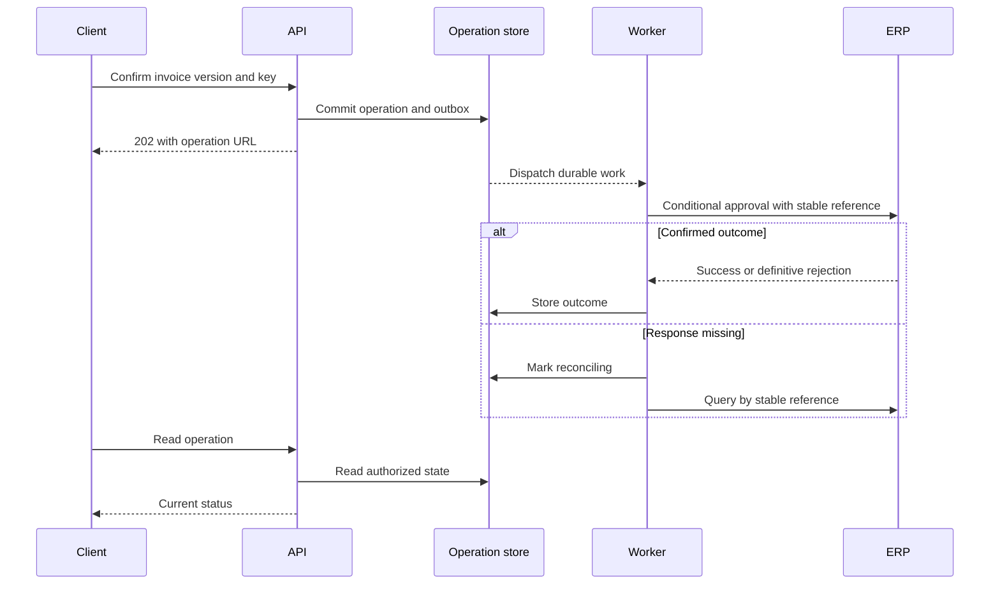

# 02 — API boundaries and request lifecycle

Previous: [Requirements and capacity](01-requirements-and-capacity.md). Study time: 35–40 minutes including the exercise.

## Mental model

An API is a contract across a boundary: callers know the allowed inputs, results, errors, and guarantees without knowing implementation details. The request lifecycle is everything that happens between a caller sending a request and learning its outcome. A dropped response creates uncertainty: the server may already have completed the action.

Design the contract around business resources and operations before choosing a framework. Keep identity, validation, business policy, and external adapters explicit even if they live in one application.

## When to use which interaction

| Interaction | Good fit | Cost or limitation |
| --- | --- | --- |
| Synchronous request/response | Bounded reads or quick answers | Client waits for every dependency |
| Streaming response | Showing generated text progressively | Partial output needs an explicit completion/error signal |
| Asynchronous operation resource | Slow or variable external writes | Requires durable state, polling or notifications, and recovery |

Streaming improves perceived responsiveness; it does not prove the complete answer meets the latency objective. Async acceptance also does not mean the business action succeeded.

## Construction example: review and approve an invoice

A project manager views an invoice and an AI-generated recommendation, then explicitly confirms approval. The model cannot supply approval authority. Our application records the manager's decision and tracks execution in an ERP.

These endpoints and the idempotency header below are illustrative application contracts:

| Endpoint | Input | Result |
| --- | --- | --- |
| GET /v1/invoices/{id} | Authenticated session | Authorized invoice plus its source version |
| POST /v1/answers | Question, project ID | Answer, citations, source freshness |
| POST /v1/invoices/{id}/approval-operations | Reviewed source version, confirmation; Idempotency-Key header | Accepted operation with a status URL |
| GET /v1/operations/{id} | Authenticated session | Current execution state and allowed next action |

Use tenant context verified from the authenticated actor's memberships. A project ID, invoice ID, or tenant header is a requested scope to validate, never proof of access. Check access on operation status reads too.

Example approval request:

```http
POST /v1/invoices/inv-42/approval-operations
Content-Type: application/json
Idempotency-Key: approval-client-unique-123

{"reviewed_source_version":"erp-v17","confirmed":true}
```

The server derives the actor from authentication; it must not trust a client-supplied approver identity. The confirmation is tied to the invoice, action, and version displayed to the user.

Example accepted response:

```http
HTTP/1.1 202 Accepted
Location: /v1/operations/op-123
Content-Type: application/json

{"operation_id":"op-123","status":"pending","status_url":"/v1/operations/op-123"}
```

HTTP 202 means accepted for processing, not completed. This design provides a status resource for the eventual outcome. GET is intended for safe retrieval; POST has no automatic idempotency guarantee. See [RFC 9110](https://httpwg.org/specs/rfc9110.html).

## Follow the request

1. **Edge:** establish TLS, apply size limits and coarse traffic controls, and assign a correlation ID.
2. **Identity:** validate the credential and resolve actor, tenant memberships, and scope. Do not log credentials.
3. **Validation:** reject malformed fields, unsupported values, and excessive payloads. Structural validation does not replace business authorization.
4. **Policy:** verify permission to approve this invoice and that the reviewed version is still current.
5. **Durability:** atomically reserve the deduplication key, store the operation, and record work for dispatch in the same database transaction. Return acceptance only after commit.
6. **Worker:** load the durable operation, recheck relevant permission and current source state, then invoke the ERP adapter. Use a conditional source update where available to close the race between checking and writing.
7. **Outcome:** store confirmed success, a definitive failure, or an uncertain result requiring reconciliation. The client reads the operation state.

A transactional outbox is one way to implement step 5: the transaction stores both the operation and an outgoing-work row; a dispatcher later publishes it. Publishing can repeat, so worker processing still needs deduplication. Detailed queue mechanics belong in a later lesson.



The store-to-worker arrow abstracts an outbox dispatcher and queue, not a direct database callback.

## Retries and duplicate prevention

Scope a deduplication key to the tenant, operation type, and appropriate caller context. Store a canonical request fingerprint and operation ID under a unique constraint. Concurrent equal requests must resolve to one operation. Reusing the key with a different payload returns a documented conflict.

Authenticate and authorize before returning any stored result. Document how long keys remain valid; expiration can make a late retry look like a new command. Add business constraints where appropriate: a new key must not permit an invalid second approval.

Local deduplication cannot guarantee a single external side effect. If the ERP applied approval and its response was lost, retrying a non-idempotent write can duplicate the action. Prefer a provider-supported idempotency mechanism or queryable external operation reference. If neither exists, place the operation into reconciliation/manual review rather than automatically repeating an ambiguous write.

## Errors that help clients recover

Use a stable error type and correlation ID. RFC 9457 defines the application/problem+json format. Human-readable detail must not expose internal secrets or unauthorized record information.

| Situation | Suggested response | Client behavior |
| --- | --- | --- |
| Malformed JSON | 400 | Fix request |
| Missing/invalid credentials | 401 with applicable authentication challenge | Authenticate again |
| Known actor lacks permission | 403, or policy-consistent 404 to conceal existence | Do not retry blindly |
| Body-supplied reviewed version is stale | 409 under this contract | Fetch, review, confirm again |
| HTTP If-Match precondition fails | 412 | Refresh the targeted representation |
| Temporary overload | 503, optionally Retry-After | Back off within the request budget |
| Accepted async operation | 202 | Follow the status resource |

A body version check and HTTP If-Match have different contracts. If using If-Match, its validator must describe the target resource; do not attach an invoice ETag to an unrelated operation endpoint and assume standard conditional semantics.

## Tradeoffs and failure modes

- **Synchronous versus async:** Keeping the HTTP connection open is simpler for short operations; a durable operation record makes long-running work recoverable but adds lifecycle complexity.
- **Deadline propagation:** Each dependency receives only the remaining budget. Three independent five-second timeouts can violate a five-second end-to-end target. Connection loss or client timeout does not automatically roll back committed work.
- **Permission changes:** Reject execution if approval authority was revoked while queued. Record the decision for audit.
- **Stale invoices:** Source-level conditional mutation prevents approving changed content. A pre-write read alone leaves a race; if the source lacks conditional writes, document the weaker guarantee and choose an acceptable workflow.
- **Versioning:** Add optional fields carefully and document defaults. Clients may mishandle new enum values; introduce explicit compatibility rules and contract tests.
- **Observability:** Track API latency separately from acceptance-to-completion time, pending-operation age, reconciliation backlog, and duplicate submissions. Correlation IDs connect events; they are not authorization credentials.

## Interview prompt

> A manager approves a construction invoice from a mobile app. The request times out. The app retries, while the ERP may already have applied the approval. Design the API and request lifecycle so the UI reports the truth and the system avoids duplicate actions.

Spend five minutes covering the contract, persistence boundary, source-system guarantees, and recovery.

## Worked answer

**One-line conclusion:** Persist an identifiable approval operation before acknowledging it, and reconcile uncertain ERP outcomes before retrying the external action.

“I would authenticate the manager, validate invoice access and approval authority, and require confirmation of the displayed source version. The client sends a stable key for that intended approval. In one transaction, I store the operation, fingerprint, unique key, and dispatch record. The API returns 202 with an authorized status URL. An equal retry returns the same operation; a changed payload conflicts. The worker rechecks permissions and uses a source-supported conditional write plus a stable external reference. If the ERP response is lost, the state becomes reconciling until a source query establishes the result. Without provider deduplication or a reliable lookup, I would require manual resolution rather than claim exactly-once execution. I would test concurrent retries, crashes after source success, stale versions, revoked access, and backlog growth.”

## Practice lab

On paper or in code, trace these five cases. For each, specify the HTTP response, durable state, and whether an ERP call is allowed:

1. Two identical submissions arrive simultaneously.
2. One key is reused with a different invoice version.
3. The API crashes after committing the operation but before responding.
4. The worker crashes after ERP success but before saving success locally.
5. A different tenant guesses the operation ID.

Expected properties: one local operation for case 1; conflict for case 2; reuse durable state for case 3; reconcile case 4; deny access without leaking operation details for case 5.

## References

- [RFC 9110 — HTTP semantics](https://httpwg.org/specs/rfc9110.html): methods, conditional requests, and status codes.
- [RFC 9457 — Problem details](https://www.rfc-editor.org/rfc/rfc9457): interoperable error bodies.
