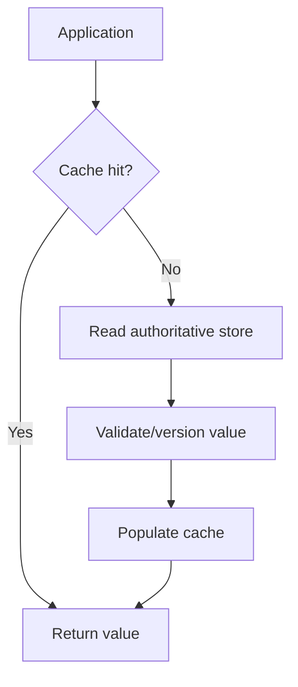

# 04 — Caching and invalidation

Previous: [Relational data modeling and indexes](03-relational-data-modeling-and-indexes.md). Study time: 35–45 minutes including the exercise.

## Mental model

A cache stores a reusable copy of an expensive result closer to the caller. It trades freshness, memory, and operational complexity for lower latency, lower dependency load, or lower compute cost.

Every cache design must answer five questions:

1. **What is the authoritative source?**
2. **What exactly is the cache key?**
3. **How stale may the value become?**
4. **What event refreshes or invalidates it?**
5. **What happens on a miss, outage, eviction, or concurrent refresh?**

A cache hit is only useful when it returns the correct value for the current tenant, user, permissions, source version, and request semantics.

## When caching helps

Cache after measuring a repeatable expensive path. Common layers are:

| Layer | Good candidates | Main risk |
| --- | --- | --- |
| Browser or CDN | Public or safely partitioned HTTP responses and static assets | Accidental caching of private responses |
| API gateway | Shared, deterministic reads with explicit cache policy | Incomplete key variation |
| Application memory | Small, hot, process-local reference data | Different instances hold different versions |
| Distributed cache | Shared database results, sessions, rate-limit state | Network dependency and invalidation races |
| Database buffer cache | Frequently accessed pages managed by the database | Application has little direct control |
| AI semantic cache | Similar low-risk questions with reusable responses | Similar wording can hide different intent, permissions, or source state |

Do not cache merely because the database exists. If the indexed query already meets the latency and capacity target, another distributed component may cost more reliability than it saves.

## Construction example

The invoice assistant repeatedly displays invoice summaries and answers questions about project records. Requirements differ by data class:

| Data | Freshness need | Suggested approach |
| --- | --- | --- |
| Public product documentation | Minutes or hours | HTTP/CDN caching |
| Project name and stable metadata | Tens of seconds may be acceptable | Cache-aside with tenant-scoped key |
| Invoice status before approval | Must be current enough for a consequential decision | Authoritative read or version validation |
| User permissions | Security critical and revocable | Short-lived cache with explicit invalidation; recheck before writes |
| Generated answer | Depends on question, documents, permissions, model and prompt versions | Versioned exact cache only after evaluation; avoid broad semantic reuse for sensitive decisions |

The same endpoint can have different cache rules by response sensitivity. Make those rules explicit rather than relying on framework defaults.

## Cache keys are part of correctness

A cache key represents every input that can change the result. For an invoice summary, a conceptual key could be:

```text
invoice-summary:v3:{tenant_id}:{invoice_id}:{source_version}:{authorization_scope_version}
```

The prefix versions the cached representation. Tenant and invoice identify the resource. Source version prevents old invoice data from masquerading as current. An authorization version or equivalent invalidation mechanism prevents a response generated under old permissions from being reused after access changes.

Never accept tenant identity directly from an unverified client header as the key boundary. Resolve the tenant and scopes from authenticated membership first. Avoid putting PHI, credentials, raw prompts, or other sensitive content directly into cache keys or logs; use non-sensitive identifiers or keyed hashes where appropriate.

For list queries, the key also needs filters, sort order, pagination cursor, locale, and any fields that influence visibility. Normalize these inputs so equivalent requests do not create needless duplicate keys.

## Core patterns

### Cache-aside

The application reads the cache first. On a miss, it reads the source, stores a bounded copy, and returns it.



Use cache-aside for read-heavy data when a miss can safely fall back to the source. The first request after expiration is slower.

### Write-through

The application updates the cache as part of the write path, usually alongside the authoritative store. It improves read-after-write behavior but creates a dual-write problem unless ordering and failures are designed carefully. The database remains authoritative; a cache update cannot prove the business write committed.

### Invalidate on write

After committing the source change, remove affected keys. The next read repopulates them. Invalidation is often safer than constructing every derived value during the write, but delivery can be delayed or lost.

Use a durable change event or outbox when invalidation must survive process crashes. Consumers should be idempotent. TTL remains a bounded backstop, not the primary guarantee.

### Refresh ahead

Refresh hot entries shortly before expiry to reduce misses. Apply it selectively; refreshing cold entries wastes capacity and can keep obsolete data alive.

## The invalidation race

A simple delete-after-write still has races:

1. Request A misses the cache and reads invoice version 17.
2. Request B updates the database to version 18 and invalidates the key.
3. Request A writes its older version 17 into the now-empty cache.

Versioned keys prevent version 17 from occupying the version 18 key. Another option is compare-and-set logic that refuses an older version. For mutable unversioned keys, define how readers detect and reject stale versions.

For read-after-write correctness, the writer can return the committed representation directly, and subsequent critical reads can go to the authoritative store or require a minimum version. A cache is not a substitute for concurrency control.

## TTL is a product decision

A time-to-live places an upper bound on staleness only if expiration works as assumed and old values are not reintroduced. Choose it from business impact:

- A 15-minute stale equipment manual may be acceptable.
- A 15-minute stale invoice status can cause duplicate work.
- A 15-minute stale permission can expose records after access is revoked.

Add jitter to TTLs so many keys do not expire simultaneously. For example, select a TTL within a safe range rather than setting every entry to exactly 300 seconds. Jitter must remain within the permitted freshness window.

Negative caching can briefly store “not found” results to absorb repeated misses. Keep its TTL short when records may soon be created, and never let a cached absence bypass authorization or reveal whether another tenant owns an identifier.

## Prevent cache stampedes

When a hot key expires, hundreds of requests may hit the database together. Common controls include:

- **Single-flight/request coalescing:** one caller refreshes while others wait for its result.
- **Stale-while-revalidate:** serve a permitted stale value while one refresh runs.
- **Soft and hard expiry:** begin refresh at a soft deadline; stop serving at the hard deadline.
- **Concurrency limits:** bound source refreshes so cache failure cannot overload the database.
- **Backoff and jitter:** avoid synchronized retry storms.

Decide whether waiting callers fail, receive stale data, or bypass the cache. The right answer depends on the data. A stale project logo is different from stale approval authority.

## HTTP caching

HTTP caching already defines freshness and validation semantics. Use `Cache-Control`, validators such as `ETag`, and conditional requests deliberately.

Examples:

```http
Cache-Control: public, max-age=3600
ETag: "manual-v12"
```

This can fit a public immutable-enough manual. A private invoice response might use:

```http
Cache-Control: private, no-store
```

Choose directives based on the actual sensitivity and product behavior. `no-store` asks caches not to store the response; `no-cache` permits storage but requires validation before reuse. Treat `Vary` carefully because missing dimensions can mix representations, while high-cardinality dimensions can destroy cache efficiency.

RFC 9111 defines HTTP cache freshness and validation. Do not invent custom behavior when standard HTTP semantics fit.

## AI answer caching

Exact caching can reuse an answer only when all material inputs match. A safe key might include:

- tenant and authorization scope version;
- normalized question;
- retrieved document IDs and versions;
- retrieval configuration;
- model, prompt, tool, and policy versions;
- locale and output format.

This is often expensive to key correctly, which is evidence that broad answer reuse may be inappropriate.

Semantic caching matches similar questions by embedding distance. It can reduce model cost, but similarity is not equivalence. “Can I approve invoice 42?” and “Was invoice 42 approved?” can be close in vector space while requiring different facts and authority. Avoid semantic reuse for high-impact actions, patient-specific answers, rapidly changing data, and requests whose permissions differ. Evaluate false-hit cost, not just hit rate.

A safer pattern is to cache lower-risk components such as public instructions, embeddings of versioned documents, or deterministic retrieval results, while regenerating the final answer under current authorization and source state.

## Eviction and memory limits

A cache must have a memory budget and an eviction policy. LRU favors recently used entries; LFU favors frequently used entries; TTL-based policies consider only expiring keys in some systems. The workload decides which performs well.

Monitor per-shard memory and key distribution. One hot tenant or oversized value can create uneven memory pressure. Cache entries are copies, so normal eviction should reduce performance rather than destroy correctness. If eviction causes incorrect results, the cache has accidentally become a source of truth.

## Failure modes and graceful degradation

| Failure | Risk | Response |
| --- | --- | --- |
| Cache unavailable | Every request reaches the source | Concurrency-limit fallback; fail fast before overwhelming the database |
| Hot key expires | Stampede | Single-flight, jitter, stale-while-revalidate where allowed |
| Invalidation event lost | Stale value persists | Durable events, version checks, bounded TTL |
| Wrong tenant in key | Cross-tenant disclosure | Tenant-scoped keys plus authorization before cache lookup/return |
| Permission revoked | Previously cached response remains visible | Permission version/invalidation and authoritative check for sensitive access |
| Oversized entry | Memory pressure and eviction churn | Size limits, compression where safe, reject unsuitable objects |
| Low hit rate | Added latency and cost | Remove or redesign the cache |
| Stale AI answer | Incorrect or unsafe guidance | Version all material inputs; bypass cache for high-risk requests |

During a cache outage, protect the authoritative store. A cache designed only for performance should be bypassable, but unbounded bypass traffic can turn one failure into a database outage.

## What to measure

Measure by cache and use case:

- hit, miss, and stale-serve rates;
- p50/p95/p99 hit and miss latency;
- source load avoided and source load during cache failure;
- fill errors, invalidation lag, and refresh duration;
- evictions, memory use, key count, and value-size distribution;
- stampede/coalescing waiters;
- correctness incidents and authorization failures;
- for AI caches: exact-hit and semantic-hit quality, false-hit rate, tokens and cost saved.

A high hit rate can still be harmful if it mostly caches cheap queries or returns stale sensitive data. Tie cache metrics to latency, cost, and correctness goals.

## Interview prompt

> Design caching for a multi-tenant construction assistant. Project metadata is read frequently, invoice status changes during approvals, permissions can be revoked, and generated answers are expensive. The database must survive a cache outage.

Spend five minutes defining what you cache, keys and TTLs, invalidation, stampede control, security boundaries, outage behavior, and metrics.

## Worked answer

**One-line conclusion:** Cache only data with a defined staleness budget, and make tenant, authorization, and source versions part of correctness.

“I would start from measured hot paths. Stable project metadata can use cache-aside with tenant-scoped, representation-versioned keys and jittered TTLs. Invoice status used for approval gets an authoritative version check; the writer returns the committed result and invalidates affected derived keys through a durable event. Permission data has a short lifetime and explicit invalidation, with authorization rechecked before sensitive reads and every write. For expensive AI answers, I would first cache versioned retrieval artifacts or exact responses whose document, model, prompt, policy, and authorization versions match; I would avoid semantic reuse for approvals. Single-flight and stale-while-revalidate protect hot reads where staleness is allowed. During cache failure, concurrency limits and load shedding protect the database. I would measure hit rate alongside miss latency, source load, invalidation lag, evictions, and false AI-cache hits.”

## Practice lab

Classify each item as cacheable or authoritative-read-first, then define the key, freshness budget, invalidation trigger, and outage behavior:

1. Public equipment manual.
2. Project display name.
3. Invoice status on the approval screen.
4. User’s permission to approve invoices.
5. Answer to “Which invoices became overdue today?”
6. Embedding for version 12 of a project specification.

Then trace this race: a reader loads invoice version 17, a writer commits version 18 and deletes the cache key, and the reader writes version 17 into the empty cache. Explain how versioned keys or conditional cache writes prevent the stale refill.

## References

- [RFC 9111 — HTTP Caching](https://www.rfc-editor.org/rfc/rfc9111.html)
- [Amazon Builders’ Library — Caching challenges and strategies](https://aws.amazon.com/builders-library/caching-challenges-and-strategies/)
- [Redis documentation — Key eviction](https://redis.io/docs/latest/reference/eviction/)
