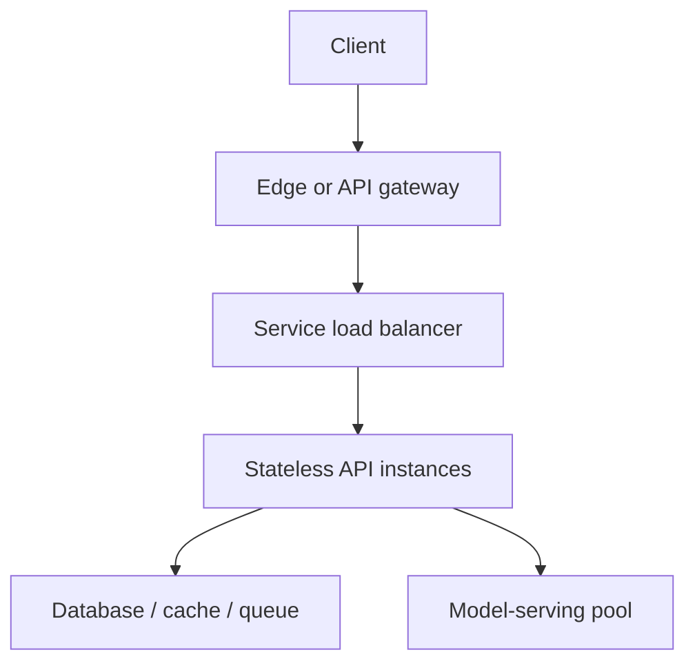

# 06 — Load balancing and stateless services

Previous: [Queues, delivery semantics, and idempotent consumers](05-queues-delivery-semantics-and-idempotent-consumers.md). Study time: 40–50 minutes including the exercise.

## Mental model

A load balancer is a traffic director. It selects a healthy destination for each request or connection while enforcing a policy about capacity, locality, and failure.

It does not make an application scalable by itself. Scaling works when:

1. requests can run on multiple interchangeable instances;
2. required state lives in durable shared systems or travels safely with the request;
3. unhealthy instances stop receiving new work;
4. downstream dependencies can tolerate the resulting concurrency.

**Stateless** means any healthy instance can continue the interaction using authoritative external state. It does not mean the process holds no memory. Instances still use connection pools, caches, model weights, and temporary buffers; correctness must not depend on one particular instance retaining them.

## When to use load balancing

Use load balancing to:

- spread traffic across application instances or availability zones;
- remove unhealthy or draining instances from rotation;
- scale independent workloads separately;
- route by host, path, protocol, tenant tier, or model capability;
- perform controlled rollouts and failover;
- terminate TLS or enforce edge policies when appropriate.

One instance may be enough for an internal prototype. Add a second failure domain before promising availability that a single process, node, or zone cannot provide.

Do not confuse load distribution with overload protection. A balancer can send traffic evenly while every destination is saturated. Admission control, bounded queues, concurrency limits, and load shedding remain necessary.

## Layers and request path

A common path is:

Different layers solve different problems:

| Layer | Typical decisions | Watch for |
| --- | --- | --- |
| DNS/global traffic manager | Region selection, disaster failover | DNS caching and slow convergence |
| Layer 4 balancer | TCP/UDP connection routing | Long-lived connections create uneven request load |
| Layer 7 proxy/gateway | HTTP host/path/header routing, auth, quotas | Added latency and a critical control point |
| Service mesh/client-side balancing | Service-to-service endpoint selection | Operational complexity and stale endpoint views |
| Application router | Tenant/model/tool-specific placement | Business logic leaking into infrastructure |

Prefer the simplest layer that has the information required for the decision.

## Routing algorithms and tradeoffs

| Algorithm | Strength | Failure mode or tradeoff |
| --- | --- | --- |
| Round robin | Simple for similar requests and instances | Ignores active work and heterogeneous capacity |
| Weighted round robin | Supports unequal capacity and canaries | Static weights become wrong as workload changes |
| Least connections | Helps with long-lived connections | One connection may contain far more work than another |
| Least outstanding requests | Reacts to active request load | Requires timely metrics; can chase noisy signals |
| Consistent hashing | Keeps a key near the same shard or cache | Hot keys overload one target; membership changes still move keys |
| Power of two choices | Samples two targets and picks the less loaded | Needs a useful load signal but scales cheaply |

The correct unit is often not “request count.” A metadata lookup, 200-page OCR job, and long LLM generation consume very different resources. Route expensive asynchronous work through queues; for synchronous inference, consider estimated tokens, active sequences, GPU memory, and prefix-cache locality.

Avoid hard affinity unless correctness requires it. Sticky sessions improve locality but concentrate traffic, complicate failover, and conceal state that should be externalized.

## Health checks: alive is not ready

Use distinct signals:

- **Liveness:** should the platform restart this process?
- **Readiness:** should this instance receive new traffic?
- **Startup:** has slow initialization completed?
- **Dependency health:** can the service satisfy this class of request?

A liveness check should usually verify the process itself, not every dependency. Restarting all API instances because the database is temporarily unavailable creates a restart storm. Readiness may fail when the process cannot serve safely, but removing every instance can also leave no place to return a controlled error.

Health endpoints should be cheap, bounded, and representative. A static `200 OK` proves little; a deep check that runs an expensive database query can become its own outage.

Use passive health signals too: connection failures, error rate, latency, and consecutive unsuccessful requests. Avoid ejecting instances on a single noisy failure.

## Connection draining and deployments

Removing an instance from discovery is not enough. During a rollout or scale-down:

1. mark the instance unready;
2. stop assigning new traffic;
3. allow in-flight requests to finish within a grace period;
4. cancel or transfer work that exceeds the deadline;
5. close connections and terminate.

Align the load balancer drain timeout, server shutdown grace period, application request deadline, and platform termination window. If the platform kills the process first, users see reset connections and may retry writes.

For WebSockets, streaming responses, and LLM token streams, define a maximum lifetime and reconnection protocol. Indefinite connections prevent clean draining.

## Stateless service design

Keep these outside a single application instance:

- durable business state in a database;
- sessions in signed short-lived tokens or a shared session store;
- idempotency records and operation status in durable storage;
- uploaded documents in object storage;
- background work in a durable queue;
- workflow checkpoints in a database;
- shared rate-limit state when limits must be globally enforced.

Process memory is appropriate for disposable acceleration: caches, pooled connections, compiled prompts, and loaded models. A restart may make requests slower but must not corrupt business state.

### Session choices

| Approach | Benefit | Tradeoff |
| --- | --- | --- |
| Signed token | No shared lookup for basic identity claims | Revocation and stale authorization need a plan; keep payload small |
| Shared session store | Central revocation and server-controlled state | Adds a network dependency |
| Sticky session | Easy migration for legacy stateful apps | Failover loses locality; uneven load; harder deployments |

Authentication claims are not authorization forever. Resolve tenant membership and sensitive permissions with a freshness policy, and recheck before consequential actions.

## Timeouts, retries, and load amplification

Every hop needs a deadline. The downstream timeout must fit within the caller’s remaining budget. A request that has already exceeded its user deadline should not keep consuming database or GPU capacity.

Retries can multiply traffic during failure. If several layers each retry three times, one user request can trigger many downstream attempts. Retry at one appropriate layer, only for transient and safe operations, with a small attempt budget and jitter. Preserve the idempotency key for writes.

Use a retry budget: when retries become a meaningful fraction of normal traffic, stop amplifying the outage. Hedged requests can reduce tail latency for idempotent reads, but they deliberately create extra load and should be delayed, bounded, and canceled when one copy succeeds.

## Overload, backpressure, and fairness

Protect each constrained resource:

- cap requests and connections per instance;
- cap concurrent database queries and outbound calls;
- cap active model sequences or tokens;
- use bounded queues rather than unlimited in-memory waiting;
- reject early with a clear status such as `429` or `503`;
- include `Retry-After` when the system can offer useful guidance;
- prioritize interactive work over bulk jobs without starving the latter.

Autoscaling is delayed feedback, not instant protection. Scale on signals that predict the bottleneck: CPU for compute-bound APIs, concurrency or latency for blocking services, queue age for workers, and GPU memory or active sequences for inference.

Fairness is a correctness concern in multi-tenant systems. Apply per-tenant quotas or weighted fair sharing so one construction customer’s document import cannot exhaust every worker. Keep an emergency capacity margin for health checks, status reads, and operational recovery.

## Construction operations example

A construction assistant serves project questions, uploads specifications, and starts invoice approvals.

- The global layer selects a healthy region.
- An HTTP gateway validates basic request shape, assigns a trace ID, applies tenant-aware rate limits, and routes `/api` separately from uploads.
- Stateless API instances authenticate the user and resolve tenant membership.
- Large uploads go directly to object storage using scoped signed URLs rather than passing through API memory.
- Document extraction enters a queue; it does not occupy an HTTP worker.
- Approval requests use an idempotency key and durable operation state.
- Read traffic can scale independently from approval workers.
- A separate inference pool routes requests by model and capacity.

For a deployment, an API instance becomes unready before termination and drains requests. If it dies, another instance can answer status checks because operation state is in the database, not local memory.

## Production AI routing

AI serving adds heterogeneous work:

- prompt length and expected output tokens affect duration;
- model replicas may have different weights, quantization, or hardware;
- batching improves throughput but can increase waiting time;
- prefix-cache affinity can reduce computation;
- streaming holds connections open;
- tool calls create downstream dependencies.

Route only to replicas that advertise the required model and version. Keep model version in traces and evaluation records. During a canary, use deterministic assignment—often a stable hash of tenant or conversation—to avoid one conversation switching behavior between turns, while still storing conversation state externally.

Do not blindly use session affinity to preserve model conversation state. Persist the authoritative conversation or workflow checkpoint, then treat replica-local key/value caches as disposable optimizations. If a replica fails, the system may recompute context but should continue correctly.

Separate interactive and batch inference pools when their latency objectives conflict. Apply token or concurrency budgets per tenant, and degrade intentionally: choose a smaller approved model, shorten optional context, queue low-priority work, or reject requests. Never silently change to a model that violates the task’s quality or compliance requirement.

## Healthcare variation

For a clinical operations assistant, isolate interactive chart review from bulk backfills. Route only after authentication, but enforce authorization inside the application as well; the balancer is not the security boundary.

Keep PHI out of routing headers and ordinary access logs unless explicitly required and protected. Use opaque tenant or organization identifiers. If a region or deployment is constrained by data residency or a business-associate agreement, routing must respect that policy before considering latency.

During failover, verify that the target region has an allowed, sufficiently current data replica. Availability does not justify returning cross-patient or unauthorized data.

## Failure modes

| Failure | Consequence | Response |
| --- | --- | --- |
| Health check always returns 200 | Broken instance receives traffic | Representative readiness plus passive health |
| Deep liveness check depends on database | Dependency outage restarts every instance | Keep liveness process-local |
| Sticky sessions hold business state | Failover loses user workflow | Externalize durable session and operation state |
| Long request survives scale-down poorly | Reset connection and duplicate retry | Drain with aligned deadlines and idempotency |
| Round robin mixes cheap and expensive work | One instance overloads | Route by concurrency/cost; move batch work to queues |
| Retry at every layer | Failure becomes traffic storm | Single retry owner and retry budget |
| Autoscaler reacts too late | Latency spikes before capacity arrives | Admission control, headroom, predictive signals |
| One tenant floods shared pool | Noisy-neighbor outage | Per-tenant quota and fair scheduling |
| All traffic shifts during recovery | Newly healthy instances overload | Slow start and gradual weight increase |
| Canary receives unrepresentative traffic | Bad rollout decision | Stable representative allocation and per-version metrics |
| Model replica fails mid-stream | Partial answer and retry ambiguity | Mark stream incomplete; resume or retry under explicit policy |
| Cross-region failover ignores data policy | Compliance or consistency breach | Policy-aware routing and recovery checks |

## Observability and capacity signals

Measure by route, tenant tier, zone, instance, and version while controlling label cardinality:

- request rate, success rate, and p50/p95/p99 latency;
- active and queued requests;
- rejected and shed requests by reason;
- upstream connection errors and reset rate;
- healthy, ready, draining, and ejected instances;
- load distribution and coefficient of imbalance;
- saturation of CPU, memory, connection pools, database pools, and GPU memory;
- retry, hedge, and timeout rates;
- deployment version and canary error/latency/quality deltas;
- end-to-end trace time and remaining deadline at each hop;
- inference time to first token, tokens per second, batch size, and active sequences.

Average utilization can hide one hot instance. Inspect distributions and maximum saturation. A good balancer cannot compensate for a hot key, leaked connection, or downstream bottleneck it cannot see.

## Interview prompt

> Design the request-serving layer for a multi-tenant construction assistant. It has project searches, large uploads, invoice approvals, and streaming LLM answers. Traffic is bursty, one tenant may run a bulk import, instances deploy frequently, and no accepted approval may be lost or duplicated.

Spend five minutes covering routing layers, statelessness, health checks, draining, algorithm choice, overload protection, retries, tenant fairness, model serving, and metrics.

## Worked answer

**One-line conclusion:** Make API instances replaceable, route using the real bottleneck, and reject excess work before retries or noisy tenants collapse shared dependencies.

“I would put an HTTP gateway in front of stateless API instances and route uploads, transactional APIs, and streaming inference separately. Durable sessions, idempotency records, workflow status, and files live in shared stores; process memory is only an optimization. Readiness removes instances from traffic, liveness stays process-local, and shutdown marks an instance unready before a bounded drain. Ordinary API calls use least-outstanding-request or power-of-two routing, while inference uses model capability, active sequences, token estimates, and gradual canary weights. Large extraction jobs enter a queue. I would enforce per-tenant quotas, bounded concurrency at the database and model pools, and early `429` or `503` responses when saturated. One layer owns bounded retries, and write retries preserve their idempotency key. I would measure tail latency, saturation, imbalance, rejected load, retries, drain failures, and per-model quality as well as availability.”

## Practice lab

Draw the path for these four operations:

1. project metadata read;
2. 500 MB specification upload;
3. invoice approval;
4. streaming answer using a large model.

For each, specify:

- routing layer and algorithm;
- authoritative state location;
- timeout and retry owner;
- concurrency or quota limit;
- behavior when an instance drains;
- behavior when the downstream dependency is saturated.

Then answer: two instances each report 50% CPU, but one has 200 active LLM streams and the other has 10. Why does round robin fail, which load signal should routing use, and how would you prevent a single tenant from occupying every stream?

## References

- [AWS Elastic Load Balancing User Guide — How Elastic Load Balancing works](https://docs.aws.amazon.com/elasticloadbalancing/latest/userguide/how-elastic-load-balancing-works.html)
- [Kubernetes documentation — Configure liveness, readiness, and startup probes](https://kubernetes.io/docs/tasks/configure-pod-container/configure-liveness-readiness-startup-probes/)
- [Kubernetes documentation — Pod lifecycle and termination](https://kubernetes.io/docs/concepts/workloads/pods/pod-lifecycle/)
- [Google Cloud Architecture Framework — Load balancing](https://cloud.google.com/architecture/framework/reliability/load-balancing)
- [AWS Builders’ Library — Using load shedding to avoid overload](https://aws.amazon.com/builders-library/using-load-shedding-to-avoid-overload/)
- [AWS Builders’ Library — Timeouts, retries, and backoff with jitter](https://aws.amazon.com/builders-library/timeouts-retries-and-backoff-with-jitter/)
