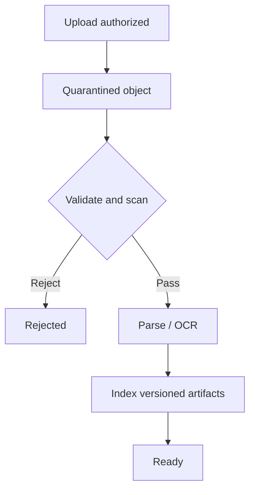

# 07 — Object storage and safe document ingestion

Previous: [Load balancing and stateless services](06-load-balancing-and-stateless-services.md). Study time: 45–55 minutes including the exercise.

## Mental model

Object storage is a durable key-to-blob system for files and other large, mostly immutable values. The application database stores **meaning and control state**; object storage holds the bytes.

For document ingestion, think of each upload as untrusted evidence moving through a state machine:



Uploading bytes is not the same as making a document searchable. A reliable ingestion system must prove:

1. who was allowed to upload;
2. which tenant and record own the object;
3. which exact bytes were processed;
4. which parser, OCR, chunking, and embedding versions produced each artifact;
5. whether the document is safe and ready;
6. how replacement, deletion, retention, and reprocessing work.

The central rule is: **never let an object key or client-supplied filename decide authorization.**

## When to use object storage

Use object storage for:

- drawings, specifications, contracts, invoices, photos, scans, audio, and model artifacts;
- large immutable outputs such as OCR text or page images;
- durable originals that need lifecycle policies or version history;
- direct client uploads that should bypass application-server memory;
- data that is read as a whole or in ranges rather than updated row by row.

Use a relational database for document ownership, tenant identity, workflow state, authorization references, hashes, versions, retention policy, and lineage. Small transactional fields belong beside the business record, not hidden inside mutable object metadata.

A filesystem on one application instance is appropriate only for disposable scratch space. It fails under horizontal scaling, rescheduling, and multi-zone recovery.

## Separate identity, metadata, and bytes

A robust design separates three identifiers:

| Identifier | Purpose |
| --- | --- |
| `document_id` | Stable business identity shown to the application |
| `document_version_id` | Immutable version of the document and its processing lineage |
| `object_key` | Internal storage location for exact bytes |

Do not use a filename as any of these. Filenames collide, reveal sensitive information, contain unsafe characters, and can change without changing the document.

A conceptual metadata model:

```sql
documents(
  tenant_id, document_id, business_record_id,
  current_version_id, created_by, created_at
)

document_versions(
  tenant_id, document_version_id, document_id,
  object_key, byte_length, media_type,
  content_sha256, status, created_at,
  retention_class, source_system, source_version
)

processing_runs(
  tenant_id, run_id, document_version_id,
  pipeline_version, parser_version, ocr_version,
  chunker_version, embedding_model,
  status, started_at, completed_at, error_class
)
```

Enforce tenant-scoped foreign keys. The database is the authorization and workflow source of truth; storage names are implementation details.

## Direct upload protocol

Large uploads should usually go directly from the client to object storage:

1. The client asks the API to create an upload.
2. The API authenticates the user, resolves tenant membership, checks permission and quota, creates a `PENDING_UPLOAD` row, and chooses a random server-generated object key under a quarantine prefix or bucket.
3. The API returns a short-lived signed upload URL or form constrained to that exact key and allowed properties.
4. The client uploads bytes directly.
5. The client calls `complete`, or a storage event triggers verification.
6. The service reads object metadata from storage, verifies expected size/checksum/type policy, and atomically moves the database state to `QUARANTINED`.
7. A durable queue starts validation and extraction.

A signed URL grants temporary capability to perform the signed operation. It does not authenticate the uploaded content, prove business completion, or replace the database authorization check.

Constrain signed uploads where the platform supports it:

- exact object key;
- short expiration;
- operation and HTTP method;
- maximum expected size or form condition;
- expected checksum;
- required encryption and non-sensitive tags;
- content-type as a hint, never as proof.

Never give clients broad bucket credentials. Do not overwrite a trusted object in place; create a new immutable version.

## Multipart uploads

Multipart upload improves reliability for large files because failed parts can retry independently. It also creates abandoned state and more edge cases.

Track an `upload_id`, allowed part size/count, expected total size, and deadline in the database. Completing the same business upload should be idempotent. Abort incomplete multipart uploads after a bounded period using a lifecycle rule and reconciliation job.

Verify the completed object using the storage service’s supported checksum. Do not assume a multipart ETag is a plain MD5 digest; its meaning is provider- and upload-dependent.

The application must reject completion when:

- the object is missing;
- the upload belongs to another tenant or user;
- byte size exceeds policy;
- required checksum does not match;
- the upload is expired or already terminal;
- the key differs from the server-assigned key.

## Validate content, not claims

Treat these client values as untrusted hints:

- filename and extension;
- MIME type;
- page count;
- document title;
- claimed checksum;
- embedded metadata.

Validate magic bytes/file signatures and parse within explicit limits. A file can be polyglot, malformed, encrypted, password-protected, recursively compressed, or crafted to exploit a parser.

A safe validation stage should consider:

- allowlisted formats required by the product;
- maximum raw and expanded size;
- maximum pages, dimensions, archive members, nesting depth, and processing time;
- malware scanning;
- rejection or controlled handling of macros and executable content;
- password-protected/encrypted document policy;
- parser sandboxing with no unnecessary network access;
- CPU, memory, disk, and wall-clock limits;
- removal or safe handling of active content;
- normalized output that is stored separately from the original.

A malware scanner returning “clean” is one signal, not proof of safety. Scanners and signatures can fail. Layer allowlists, isolation, least privilege, and bounded parsers.

## Quarantine and publication

Keep untrusted objects inaccessible to ordinary readers and downstream indexers. Options include a dedicated quarantine bucket/account or a prefix protected by explicit policy. Separation by bucket or account usually gives a stronger policy boundary than naming convention alone.

Only a trusted service role can promote a validated version. Promotion may mean copying to a trusted immutable key and recording the new location, or changing database visibility while keeping policy-enforced isolation. Do not expose an object merely because a storage event arrived.

Model explicit states:

```text
PENDING_UPLOAD
  -> QUARANTINED
  -> VALIDATING
  -> EXTRACTING
  -> INDEXING
  -> READY

Terminal/exception states:
EXPIRED, REJECTED, FAILED_RETRYABLE, FAILED_PERMANENT, REVIEW_REQUIRED
```

Transitions should be compare-and-set updates. Workers must tolerate duplicate events and retries. The UI reads durable state from the database, not queue internals.

## Event delivery and idempotent processing

Storage notifications are convenient triggers, but design for duplicates, delay, reordering, and possible gaps. Periodically reconcile database rows against storage so a lost notification does not strand an upload.

An idempotency key for a processing stage can include:

```text
(document_version_id, stage_name, pipeline_version)
```

Insert a processing-attempt record under a unique constraint before committing stage output. Write derived artifacts to versioned keys, then atomically mark the stage complete with references to those exact artifacts.

Do not acknowledge a queue message before durable state and outputs are recorded. A retry should reuse or safely replace only the artifacts for the same version. Never let an older processing run overwrite pointers produced by a newer document version.

## Extraction, OCR, and provenance

Preserve the original bytes even when the system produces normalized text. Derived artifacts can include:

- page images;
- text per page;
- layout blocks and coordinates;
- tables;
- OCR confidence;
- detected language;
- chunks;
- embeddings;
- thumbnails;
- safety or classification results.

Every chunk used for retrieval needs provenance back to:

- tenant;
- document and immutable version;
- page or source span;
- extraction run;
- parser/OCR/chunker versions;
- embedding model and index version;
- access-control attributes.

This lineage makes citations verifiable and lets you answer, “Which bytes and software produced this answer?”

OCR is probabilistic. Store confidence and preserve the source image. For high-impact fields such as invoice amount, patient identifier, medication, or drawing revision, use deterministic validation and human review when confidence or cross-checks fail.

## Replacement, versioning, and deletion

“Replace document” should create a new immutable version:

1. authorize a new upload;
2. validate and process it independently;
3. publish the new version only after it is ready;
4. atomically change `current_version_id`;
5. invalidate caches and retrieval entries tied to the old version;
6. retain or delete the old version according to policy.

Readers should either see the previous ready version or the new ready version, not half-produced artifacts.

Deletion is a workflow, not a single object-store call. It may need to remove or tombstone:

- original and normalized objects;
- thumbnails and OCR output;
- chunks and vector entries;
- caches;
- replicas and backups according to retention policy;
- database search results and citations.

Retention, legal hold, and medical-record rules can override ordinary deletion. Record who requested deletion, which policy applied, and completion status without keeping sensitive content in logs.

## Tenant isolation and secure delivery

Use server-side authorization before issuing a download URL. Resolve the document by `(tenant_id, document_id)`, verify the user’s current access, then issue a short-lived URL for the exact immutable version.

Controls include:

- block public access;
- least-privilege service identities;
- encryption in transit and at rest;
- tenant-aware keys or stronger storage isolation when risk demands it;
- short-lived signed URLs;
- audit logs for upload, download, processing, retention, and deletion;
- no PHI, secrets, or descriptive filenames in object keys, URLs, queue attributes, or routine logs;
- response headers that prevent unsafe inline rendering when downloads are untrusted.

Signed download URLs can leak through browser history, referrers, screenshots, and logs. Keep them short-lived and avoid logging the query string.

Encryption keys help control access but do not replace application authorization. Key rotation, deletion, recovery, and cross-region replication must match the data policy.

## Construction example

A subcontractor uploads a 500 MB project specification and revised drawing set.

- The API verifies project membership and upload permission, checks tenant quota, creates document/version rows, and issues multipart upload URLs for a random quarantine key.
- The client completes parts directly to object storage.
- Completion verifies size and checksum and moves the version to `QUARANTINED`.
- A scanner and constrained parser validate the PDF, reject active content, enforce expanded-size and page limits, and generate page images and normalized text.
- OCR runs only where embedded text is absent or unusable.
- A versioned chunker creates page-linked chunks; embeddings include tenant, project, document version, and access-policy attributes.
- Publication atomically marks the version `READY` and updates `current_version_id`.
- Search filters by authorized tenant/project and cites the exact drawing revision and page.
- A later revision creates a new version; it never overwrites the original.

If extraction fails on page 782, the UI says processing failed or review required. It does not claim the document is searchable merely because upload completed.

## Healthcare variation

For a clinical document, preserve the source-system identifier and version while avoiding PHI in storage keys and operational metadata. Quarantine, processing environments, logs, backups, and dead-letter paths require the same protection as the primary record.

Before ingestion, verify that the source, region, vendor, and intended use are allowed. Limit processor access, block unnecessary egress, audit every read, and apply the organization’s retention and legal-hold rules. Do not use an external OCR or embedding service unless the data agreement and configuration cover that PHI flow.

Identity extraction is safety critical. A document attached to the wrong patient can be worse than a failed upload. Cross-check patient identifiers against trusted workflow context, surface mismatches, and require review rather than automatically publishing uncertain associations.

## Failure modes

| Failure | Consequence | Response |
| --- | --- | --- |
| Client controls object key | Cross-tenant overwrite or disclosure | Server-generated random key plus database authorization |
| API proxies huge upload | Memory, timeout, and scaling pressure | Short-lived constrained direct upload |
| Upload completes but event is lost | Document remains unprocessed | Durable metadata plus reconciliation scan |
| Duplicate storage event | Duplicate chunks or conflicting state | Stage idempotency key and guarded transitions |
| MIME type trusts client | Malicious content reaches parser | Signature validation and format allowlist |
| Zip/PDF expands enormously | Resource exhaustion | Expanded-size, depth, page, time, and memory limits |
| Parser is compromised | Lateral movement or data theft | Sandboxed least-privilege worker with restricted egress |
| Multipart upload is abandoned | Storage cost accumulates | Expiration, abort lifecycle, reconciliation |
| New version partially processes | Mixed old and new retrieval results | Immutable versions and atomic publication |
| Old job finishes late | Stale pointer overwrites current version | Version-checked compare-and-set update |
| Signed URL is logged or shared | Unauthorized temporary access | Short lifetime, exact scope, redact query strings |
| Deletion removes original only | Derived data remains searchable | Tracked deletion workflow across all artifacts |
| OCR misreads critical value | Incorrect operational action | Confidence, deterministic checks, source citation, review |

## What to measure

Track by tenant and document class while avoiding sensitive labels:

- uploads started, completed, expired, rejected, and abandoned;
- bytes, part count, upload duration, and checksum failures;
- time in each state and oldest item per state;
- scan, parser, OCR, chunking, and embedding latency;
- retry rate and failures by stable error class;
- reconciliation discoveries and stranded objects;
- duplicate-event and idempotency-conflict counts;
- page and expanded-byte limit rejections;
- ready-to-search latency;
- citation coverage and extraction/OCR quality samples;
- storage growth by original, derivative, version, and retention class;
- deletion backlog and policy exceptions.

A fast pipeline that produces uncited or cross-tenant chunks is not healthy. Include correctness and security measures beside throughput.

## Interview prompt

> Design secure document ingestion for a multi-tenant construction assistant. Users upload 500 MB PDFs and drawing sets. Uploads may be interrupted, storage events may repeat or be lost, files are untrusted, revised documents must not mix with old chunks, and answers must cite the exact version and page. Adapt the design for PHI-bearing clinical documents.

Spend five minutes covering upload authorization, object and metadata identity, multipart completion, quarantine, validation, asynchronous processing, idempotency, version publication, tenant isolation, deletion, and metrics.

## Worked answer

**One-line conclusion:** Store immutable bytes behind tenant-authorized metadata, quarantine every upload, and publish only versioned, reproducible artifacts through idempotent stages.

“I would first create tenant-scoped document and immutable version rows, then issue short-lived multipart upload URLs for one random quarantine key. The client sends bytes directly to object storage; completion is idempotent and verifies ownership, expiration, size, and a supported checksum. Storage events only trigger work—they do not grant trust—so a reconciliation job also finds stranded versions. Workers scan and parse in a least-privilege sandbox with format, page, expanded-size, memory, and time limits. Every stage uses `(document_version_id, stage, pipeline_version)` as its idempotency boundary and writes versioned outputs. Chunks retain page-level provenance, extraction versions, tenant/project policy, and the embedding model. Only after every required stage succeeds do I atomically publish the version and switch the document’s current pointer. Downloads require current authorization and exact short-lived URLs. Replacement creates a new version, and deletion is a tracked workflow across objects, OCR, chunks, vectors, caches, and retention constraints. For PHI, I also enforce allowed regions and processors, restricted egress, protected logs and DLQs, and patient-association checks.”

## Practice lab

Design the metadata and state transitions for a 500 MB specification upload. Then trace these cases:

1. the client uploads all parts but never calls complete;
2. storage accepts the object but the notification is lost;
3. the same event is delivered three times;
4. a malformed PDF expands to 40 GB during parsing;
5. version 12 finishes indexing after version 13 is already current;
6. a user asks to delete the document while a legal hold applies.

For each case, identify the authoritative state, idempotency key, resource limit, user-visible status, and reconciliation path.

## References

- [Amazon S3 User Guide — Uploading and copying objects using multipart upload](https://docs.aws.amazon.com/AmazonS3/latest/userguide/mpuoverview.html)
- [Amazon S3 User Guide — Presigned URLs](https://docs.aws.amazon.com/AmazonS3/latest/userguide/using-presigned-url.html)
- [Amazon S3 User Guide — Checking object integrity](https://docs.aws.amazon.com/AmazonS3/latest/userguide/checking-object-integrity.html)
- [Google Cloud Storage documentation — Object versioning](https://cloud.google.com/storage/docs/object-versioning)
- [OWASP File Upload Cheat Sheet](https://cheatsheetseries.owasp.org/cheatsheets/File_Upload_Cheat_Sheet.html)
- [NIST SP 800-190 — Application Container Security Guide](https://csrc.nist.gov/pubs/sp/800/190/final)
