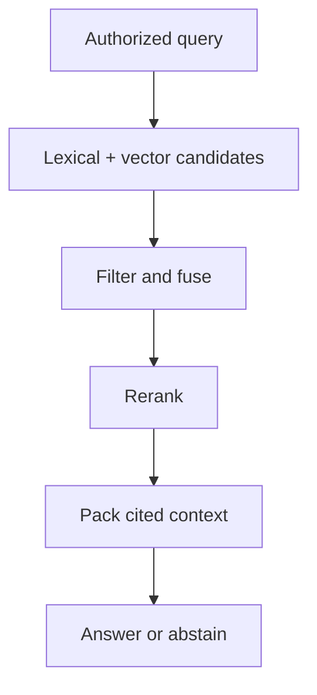

# 08 — Search indexes and hybrid retrieval

Previous: [Object storage and safe document ingestion](07-object-storage-and-safe-document-ingestion.md). Study time: 45–55 minutes including the exercise.

## Mental model

Search is a candidate-generation system, not a truth engine.

A database answers structured questions over known fields. A search index creates a read-optimized copy that can quickly find likely relevant records from text, vectors, or metadata. In retrieval-augmented generation (RAG), search should return a small, authorized, evidence-rich set for the model; the model must not invent missing evidence.

Think of retrieval as a funnel:



Each stage trades recall, precision, latency, cost, and security. Optimizing one metric in isolation can make the product worse.

## When to use each retrieval method

| Method | Best at | Weakness |
| --- | --- | --- |
| Relational query | Exact fields, joins, ranges, aggregates | Poor fit for fuzzy natural-language relevance |
| Lexical/inverted index | Exact terms, identifiers, names, error codes, rare phrases | Misses paraphrases and semantic similarity |
| Vector approximate nearest neighbor (ANN) | Semantic similarity and paraphrases | Can miss exact tokens and return conceptually similar but wrong content |
| Hybrid retrieval | Queries needing exact and semantic matching | More infrastructure, tuning, and evaluation |
| Reranker | Improving order of a small candidate set | Added latency and compute; cannot recover omitted candidates |

Use SQL for “invoices over $50,000 approved last month,” lexical search for “RFI-1042” or a specification clause, and semantic search for “requirements for curing concrete in cold weather.” Hybrid retrieval fits an assistant that receives all three kinds of language.

Do not use vector search as a substitute for deterministic calculations, authorization, or source-of-truth lookups.

## Lexical retrieval and inverted indexes

An inverted index maps normalized terms to documents or chunks containing them. Relevance functions such as BM25 favor terms that are frequent in a document but rare across the collection while controlling for document length.

Lexical retrieval is critical for:

- drawing and RFI numbers;
- vendor and medication names;
- codes, abbreviations, dimensions, and dates;
- exact quotations;
- domain terms absent or diluted in embeddings.

Analysis choices change meaning. Tokenization, lowercasing, stemming, stop-word removal, synonyms, and handling punctuation must match the domain. Splitting `RFI-1042`, `A-101.2`, or `5/8-inch` incorrectly can destroy the exact match.

Synonyms improve recall but can harm precision. “CO” might mean change order in construction, carbon monoxide in clinical notes, or Colorado in an address. Apply domain- and field-specific analyzers rather than one global synonym list.

## Vector retrieval

An embedding maps text into a vector space where distance approximates learned similarity. ANN indexes trade exactness for fast search over large collections.

Important design choices include:

- embedding model and version;
- vector dimension and distance metric;
- chunk content used to create the vector;
- ANN index type and parameters;
- candidate count;
- metadata filtering behavior;
- rebuild and rollback strategy.

Cosine, dot-product, and Euclidean distance are not interchangeable without considering model training and normalization. Follow the embedding model’s intended metric.

ANN parameters usually trade recall for memory, build cost, and query latency. Measure recall against an exact or high-quality benchmark rather than assuming a default is good enough.

Embeddings are derived data. Keep the source text and version lineage so vectors can be regenerated when the model, parser, or chunker changes.

## Chunking is an indexing decision

A chunk must be small enough to retrieve a focused fact and large enough to preserve meaning.

Common strategies:

| Strategy | Benefit | Risk |
| --- | --- | --- |
| Fixed tokens with overlap | Simple and predictable | Splits tables, headings, and clauses |
| Page-based | Easy citations | Pages may be too large or split logical sections |
| Structure-aware | Preserves headings, lists, tables, sections | Parser quality and document format matter |
| Parent-child | Retrieve small child, return larger parent context | More storage and joining logic |
| Query-time expansion | Starts precise, adds neighbors or parent | Extra latency and possible irrelevant context |

Store stable chunk IDs and provenance: tenant, document/version, page/span, section hierarchy, source type, processing versions, and access attributes.

Overlap is not free. It increases storage and can fill the top results with near-duplicates. Deduplicate or diversify before context packing.

Tables require special handling. Preserve headers with rows, units, and page coordinates. A flattened table without headers can turn an invoice amount or dosage into misleading text.

## Hybrid retrieval and rank fusion

Lexical and vector scores have different scales; adding raw scores is usually invalid. Common options are:

- normalize each score distribution before combining;
- use weighted rank fusion;
- use reciprocal rank fusion (RRF), which combines result positions rather than raw scores;
- train a fusion model from labeled relevance data.

A conceptual RRF score is:

```text
RRF(d) = Σ 1 / (k + rank_i(d))
```

where each retriever contributes a rank for document `d`, and `k` reduces the impact of top-rank differences.

RRF is a strong simple baseline because it does not require lexical and vector scores to be calibrated. Its tradeoff is that it ignores score magnitude and still needs tuning of candidate depths and retriever weights.

Query routing can improve efficiency: exact identifiers may rely heavily on lexical retrieval; broad conceptual questions may use both. But keep a fallback path, because a query classifier can be wrong.

## Metadata filtering and authorization

Authorization is a hard constraint, not a relevance feature.

Every candidate must satisfy current policy for tenant, project/patient, document version, user role, and record status. Prefer pre-filtering inside the search operation when supported and validated. Post-filtering a small top-`k` can return too few results and can leak unauthorized metadata through counts, timing, snippets, logs, or model context.

A safe query flow:

1. authenticate the caller;
2. resolve current tenant membership and permissions from trusted state;
3. translate policy into an allowed scope or security filter;
4. retrieve only within that scope;
5. revalidate sensitive records before response or action;
6. audit access without logging sensitive query text unnecessarily.

Do not accept `tenant_id`, role, or allowed project IDs from an untrusted request without server-side validation.

Large access-control lists can make per-query filters expensive. Options include security groups, project-level partitions, filtered ANN indexes, or separate indexes for stronger isolation. Each increases operational complexity. Test both security correctness and recall under realistic filters.

If the authorization service is unavailable, fail closed for protected content. Serving a broader result set is not graceful degradation.

## Reranking

A reranker evaluates the query and each candidate together, often producing better relevance than independent embedding similarity.

Use reranking after broad candidate generation:

```text
retrieve 50–200 candidates -> filter/deduplicate -> rerank -> keep 5–15
```

Numbers are workload-specific, not universal defaults. Tune them against latency and retrieval quality.

Rerankers cannot recover a relevant chunk absent from the candidate set. Candidate recall must be evaluated separately. A powerful reranker over weak candidates only orders the wrong evidence more confidently.

Apply timeouts and fallback. If reranking fails, return a transparently lower-confidence result from the fused ranking or abstain according to product risk. Never bypass authorization to increase candidate count.

## Context construction and citations

After ranking:

- remove exact and near duplicates;
- diversify across documents or sections where appropriate;
- join a child chunk to its heading or bounded neighbors;
- preserve source order for multi-part procedures;
- fit within a token budget;
- attach stable citation metadata;
- separate retrieved data from system instructions.

Retrieved documents are untrusted input. They can contain prompt injection such as “ignore prior instructions.” The system should treat them as evidence, not executable instructions. Tool permissions and action authorization must be enforced outside the model.

A citation should identify an immutable document version and page/span, not merely a filename. The UI should allow the user to inspect the cited source under a fresh authorization check.

When evidence is absent, contradictory, stale, or below a validated confidence rule, the correct output can be “I could not find enough authorized evidence.”

## Indexing pipeline and consistency

The primary database and object storage remain authoritative. The search index is a derived projection.

A reliable indexing flow:

1. a document version reaches validated extraction;
2. an outbox/event schedules indexing;
3. an idempotent worker creates chunks and embeddings under an `index_generation`;
4. the worker writes all searchable fields and access metadata;
5. validation checks counts, lineage, and sample queries;
6. publication atomically exposes the generation;
7. old generations remain available for rollback until retention permits deletion.

Search is often eventually consistent. Make this visible: a newly uploaded file can be `PROCESSING` rather than silently absent.

Use a stable business ID plus immutable version and chunk ID. Upserts must not let an old job overwrite a newer generation. Deletion uses tombstones or a tracked workflow and is reconciled across lexical indexes, vector indexes, caches, and replicas.

## Zero-downtime reindexing

Embedding, analyzer, schema, and chunking changes may require rebuilding the full index.

Use versioned indexes:

```text
documents_v7  <- current read alias
documents_v8  <- build and validate
```

Dual-write new updates during the rebuild or replay changes from an ordered log/outbox. Before cutover:

- compare expected and actual document/chunk counts;
- verify no unauthorized records or missing tenant fields;
- run a frozen retrieval evaluation set;
- test representative filters;
- measure latency and resource use;
- confirm delete/tombstone propagation;
- keep a rollback target.

Switch the read alias atomically. Do not mix embeddings from incompatible models in one vector field unless the design explicitly supports separate spaces.

## Construction example

A project manager asks:

> “Which current specifications require cold-weather concrete protection, and is RFI-1042 related?”

The service:

1. authorizes the user for the tenant and project;
2. parses `RFI-1042` as a likely exact identifier;
3. runs lexical search for the identifier and construction terms;
4. runs vector search for the conceptual requirement;
5. applies project, document-status, and current-version filters inside retrieval;
6. fuses results with RRF;
7. reranks the authorized candidate set;
8. expands the strongest chunks to include section headings and bounded neighbors;
9. returns a concise answer citing immutable specification versions, pages, and the RFI;
10. abstains from a claimed relationship if no evidence links them.

A superseded drawing may remain stored for audit but is excluded from “current requirements” unless the query explicitly requests historical versions.

## Healthcare variation

A clinician asks for notes related to “worsening kidney function” and an exact lab code. Hybrid retrieval can combine semantic language with exact codes, dates, and patient identifiers.

Patient identity and treatment relationship must constrain retrieval before content reaches the model. Avoid broad post-filtering over a cross-patient vector index unless the system can demonstrate there is no content or side-channel leakage.

Clinical time and document status matter: preliminary, corrected, and final reports are not equivalent. Index version, author, encounter, effective time, and amendment status. Cite exact records and timestamps.

Retrieval relevance is not clinical validity. An older similar note can be highly relevant but medically inappropriate for the current decision. Use freshness and source authority as explicit features or filters, and preserve clinician review for consequential use.

## Tradeoffs

| Decision | Benefit | Cost or risk |
| --- | --- | --- |
| Larger candidate set | Better chance relevant evidence is present | More latency and reranking cost |
| Smaller chunks | Precise retrieval | Lost context and more index entries |
| Larger chunks | More self-contained evidence | Diluted similarity and token waste |
| More overlap | Reduced boundary misses | Duplicate results and storage cost |
| Pre-filter authorization | Prevents unauthorized candidates | Can reduce ANN efficiency |
| Separate tenant indexes | Stronger isolation and predictable filters | Operational overhead at high tenant count |
| Reranker | Better top-result precision | Extra dependency, compute, and timeout |
| Frequent reindexing | Fresher models and analyzers | Compute cost and cutover risk |
| Historical versions searchable | Audit and comparison | Stale-version confusion unless explicitly filtered |

Make the tradeoff against the user task and failure cost, not a generic “best” architecture.

## Failure modes

| Failure | Consequence | Response |
| --- | --- | --- |
| Vector search used alone | Misses exact IDs and rare terms | Hybrid lexical/vector retrieval |
| Raw lexical and vector scores added | Unstable ranking | Calibrated fusion or RRF |
| ACL applied only after top-10 retrieval | Empty results or leakage | Authorized pre-filter and security tests |
| Client supplies tenant filter | Cross-tenant access | Derive scope from trusted authorization |
| Chunk lacks version/page lineage | Unverifiable citation | Immutable provenance on every chunk |
| New version indexed beside old as current | Contradictory answers | Current-version filter and atomic publication |
| Late worker overwrites new generation | Stale content returns | Generation-aware guarded writes |
| Reranker times out | Request fails or bypasses controls | Bounded fallback that preserves authorization |
| Overlapping chunks dominate top results | Context lacks diversity | Near-duplicate removal and diversification |
| Prompt injection in document | Model follows untrusted instruction | Treat retrieval as data; enforce tool policy externally |
| Index event is lost | Authoritative document stays absent | Outbox and reconciliation |
| Delete misses vector index | Removed content remains retrievable | Tracked deletion across every projection |
| Offline metric improves, users worsen | Evaluation set misses workload | Segment metrics and review production feedback |

## Evaluation and observability

Separate retrieval evaluation from answer evaluation.

Given queries with relevance judgments, measure:

- **Recall@k:** did the candidate set contain the relevant evidence?
- **Precision@k:** how much of the returned set was relevant?
- **MRR:** how early did the first relevant result appear?
- **nDCG@k:** did the ranking put more relevant items earlier?
- filter correctness and unauthorized-result rate;
- current-version and citation accuracy;
- latency and cost by retrieval stage;
- no-answer accuracy.

Build the evaluation set from real task families: exact identifiers, paraphrases, multi-hop questions, temporal/current-version queries, tables, OCR errors, and adversarial authorization cases. Split results by tenant type, document class, language, query length, and access scope.

Online, track candidate counts before and after filters, zero-result rate, lexical/vector overlap, reranker timeouts, index lag, stale-version hits, citation opens, user corrections, and answer abstentions. Do not log raw sensitive queries by default.

An answer-quality score cannot diagnose whether failure came from ingestion, retrieval, context construction, or generation. Preserve stage-level traces with safe identifiers and versions.

## Interview prompt

> Design retrieval for a multi-tenant construction assistant containing specifications, RFIs, drawings, invoices, and revised documents. Users ask both exact-ID and conceptual questions. Access differs by project, indexing is asynchronous, and every answer must cite the authorized current version. Adapt the design for clinical notes and lab codes.

Spend five minutes covering index schema, lexical/vector candidates, chunking, filters, fusion, reranking, versioning, reindexing, failure behavior, and evaluation.

## Worked answer

**One-line conclusion:** Generate broad candidates with lexical and vector search, enforce authorization before evidence leaves retrieval, then rerank and cite immutable current versions.

“I would keep the database and object store authoritative and build a versioned search projection. Each chunk carries tenant, project, document/version, page/span, status, access groups, extraction versions, and embedding model. Exact IDs and domain terms go through a tuned lexical index; conceptual queries also use ANN vector search. Current authorization produces server-side pre-filters, and no unauthorized candidate enters fusion or model context. I would combine rankings with RRF, remove near duplicates, rerank a bounded set, expand selected chunks with headings or neighbors, and return citations to exact versions. Indexing is idempotent by document version and generation. Rebuilds use a new index, evaluation and count checks, change replay, then an atomic alias cutover with rollback. I would measure candidate recall, top-k precision/nDCG, filter correctness, stale-version hits, no-answer accuracy, latency, index lag, and final grounded-answer quality separately.”

## Practice lab

For each query, choose SQL, lexical, vector, or hybrid retrieval and explain the filters:

1. “Show invoices over $50,000 approved in September.”
2. “Find RFI-1042.”
3. “What does the current specification require when concrete is poured below 40°F?”
4. “Did the latest drawing revision move the electrical room?”
5. “Find notes suggesting worsening kidney function for this authorized patient.”

Then design a safe reindex from embedding model `v3` to `v4`. Explain how you prevent mixed vector spaces, capture updates during rebuild, validate tenant filters, cut over atomically, and roll back.

## References

- [Elasticsearch Reference — BM25 similarity](https://www.elastic.co/docs/reference/elasticsearch/index-settings/similarity)
- [Elasticsearch Reference — Reciprocal rank fusion](https://www.elastic.co/guide/en/elasticsearch/reference/current/rrf.html)
- [OpenSearch documentation — Hybrid search](https://docs.opensearch.org/latest/vector-search/ai-search/hybrid-search/)
- [PostgreSQL documentation — Full text search](https://www.postgresql.org/docs/current/textsearch.html)
- [pgvector documentation — Vector similarity search](https://github.com/pgvector/pgvector)
- [NIST AI RMF Generative AI Profile](https://www.nist.gov/publications/artificial-intelligence-risk-management-framework-generative-artificial-intelligence)
