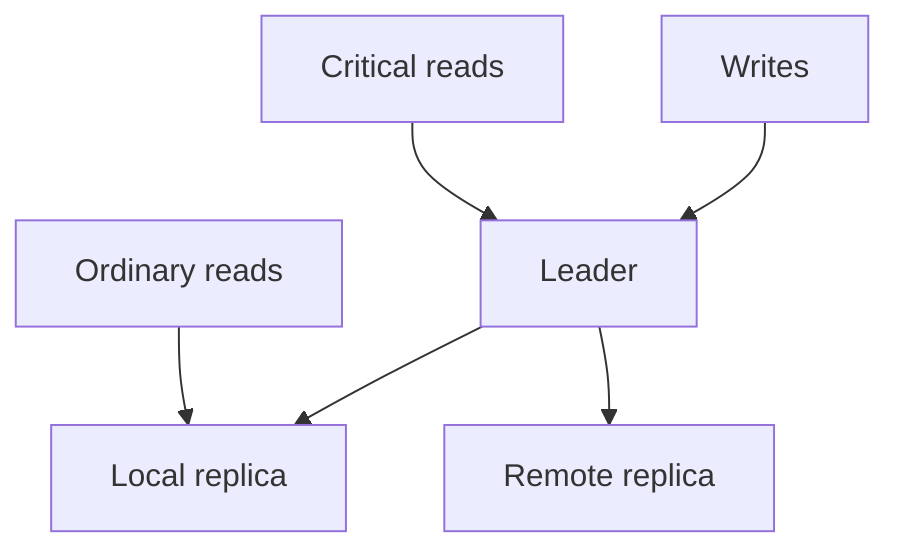

# 09 — Replication, consistency, and failover

Previous: [Search indexes and hybrid retrieval](08-search-indexes-and-hybrid-retrieval.md). Study time: 45–55 minutes including the exercise.

## Mental model

Replication keeps copies of data so a system can survive failures, serve reads closer to users, or increase read capacity. Consistency defines what relationships clients may observe among those copies. Failover changes which copy serves a role after failure.

These are separate questions:

1. **Durability:** after a success response, which failures can the committed write survive?
2. **Visibility:** when and where will a reader observe that write?
3. **Authority:** which node may accept the next write?
4. **Recovery:** how much data and time can the business lose?
5. **Conflict:** what happens if two places accept incompatible writes?

A replica is not automatically a backup. Replication quickly copies valid writes, accidental deletes, corruption, and malicious changes. Backups preserve recoverable history under a separate retention and restore process.

## Define RPO and RTO first

Two business objectives bound a recovery design:

- **Recovery Point Objective (RPO):** maximum tolerable data loss measured in time.
- **Recovery Time Objective (RTO):** maximum tolerable time to restore the capability.

“Highly available” is incomplete without a failure scope and objectives.

Examples:

| Capability | Example objective | Design implication |
| --- | --- | --- |
| Public product manual | Some stale reads may be acceptable | CDN/cache and eventual replication |
| Invoice approval | Acknowledged approval must not disappear | Durable primary commit and strict write path |
| Search index | Can be rebuilt from source | Derived projection; bounded stale window |
| Audit record | Very low loss tolerance and protected retention | Durable append path, independent archive |
| AI answer | Regenerable if evidence remains | Persist evidence/version trace when audit requires it |

Objectives must cover region, zone, database, object store, queue, identity, secrets, DNS, and staff access—not only the database.

## Replication modes

### Synchronous replication

A write is acknowledged only after required replicas confirm it.

Benefits:

- lower RPO for failures covered by the acknowledgement rule;
- promoted replicas are more likely to contain acknowledged writes.

Costs:

- write latency includes replica/network latency;
- an unavailable replica can reduce write availability;
- configuration matters: “synchronous” may still acknowledge before storage is durable or may require only one of several replicas.

### Asynchronous replication

The leader acknowledges locally and ships changes afterward.

Benefits:

- lower write latency;
- remote replica failure need not block primary writes;
- practical for distant regions and read scaling.

Costs:

- a failover can lose acknowledged writes not yet replicated;
- readers can observe stale state;
- lag grows during spikes, maintenance, or slow apply.

### Semi-synchronous and quorum approaches

Some systems acknowledge after a subset of replicas confirm. Quorums can tolerate failures when read and write sets overlap, but the guarantee depends on membership, failure detection, durable storage, and conflict rules.

Do not say “we use quorum, so it is strongly consistent” without defining:

- number and placement of replicas;
- read/write quorum sizes;
- whether writes are versioned;
- what happens during partitions;
- whether old leaders are fenced;
- the exact consistency guarantee exposed to clients.

## Single-leader replication

A common relational design has one writable leader and read replicas.



The leader serializes writes and emits a replication log. Replicas replay the log.

Advantages:

- familiar transaction semantics at the leader;
- simpler conflict model;
- read scaling.

Risks:

- leader bottleneck;
- stale replicas;
- failover interruption;
- lost writes under asynchronous promotion;
- split brain if the old leader keeps accepting writes.

A multi-leader or leaderless design can improve geographic write availability, but conflict resolution becomes product logic. Invoice approval, payment, inventory decrement, and patient-record correction rarely become safe just because a database offers last-write-wins.

## Consistency guarantees

“Strong” and “eventual” are too broad for many design discussions. Name the behavior users need.

| Guarantee | Meaning | Example |
| --- | --- | --- |
| Linearizability | Each operation appears to occur atomically in real-time order | Prevent two approvals from both winning |
| Read-your-writes | A client sees its completed write in later reads | User sees the approval they just submitted |
| Monotonic reads | A client does not move backward to older state | Status does not change from approved back to pending |
| Consistent prefix | Readers do not see later events without earlier dependencies | Invoice-paid event is not visible before invoice-created |
| Eventual consistency | Copies converge if updates stop | Search index catches up to document source |

Transactions on one leader may provide strong database behavior while caches, replicas, search indexes, queues, and external ERPs remain eventually consistent. Describe the end-to-end path, not only the database.

## Replica lag and read routing

Replica lag is the difference between the leader’s committed position and a replica’s applied position. Time-based lag is useful but can hide stalled replication when no new writes occur. Track both time and log positions/bytes.

Safe routing choices:

- send consequential reads to the leader;
- after a write, pin that session/entity to the leader for a bounded period;
- return a commit token/log position and route later reads only to replicas that have applied at least that position;
- wait for a replica to catch up within the request deadline, then fall back;
- serve explicitly labeled stale data when the product permits it.

Blindly sending all reads to replicas can break read-your-writes. A user approves invoice version 18, refreshes, and receives pending version 17. Worse, an application may make another decision from that stale state.

A cache or search index adds another replication layer. Passing a minimum source version through the request can help each layer reject data older than the required version.

## Writes, concurrency, and idempotency

Replication does not replace concurrency control.

For a consequential transition, use a guarded write on the authoritative leader:

```sql
UPDATE invoices
SET status = 'APPROVED',
    version = version + 1,
    approved_by = :user_id
WHERE tenant_id = :tenant_id
  AND invoice_id = :invoice_id
  AND status = 'PENDING'
  AND version = :expected_version;
```

Exactly one caller should observe the successful row count. An idempotency record ties retries to the same business operation.

After commit:

- return the committed representation and version;
- publish downstream work with a transactional outbox;
- route follow-up critical reads with a minimum-version requirement;
- do not treat replica absence as proof the write failed.

## Failover mechanics

A safe planned or unplanned failover requires more than changing DNS.

1. Detect that the current leader is unavailable or must be drained.
2. Stop or fence it from future writes.
3. Select an eligible replica based on health and replication position.
4. Decide whether losing unapplied writes is within the declared RPO.
5. Promote exactly one candidate.
6. update service discovery, routing, credentials, and connection pools;
7. verify writes and reads against the new leader;
8. restore redundancy by rebuilding replicas;
9. reconcile clients and external operations whose outcome was uncertain.

**Fencing** prevents an old leader from continuing to mutate shared resources. Techniques include consensus-backed leases, monotonically increasing epochs/terms, storage-level write tokens, or infrastructure isolation. A timeout alone does not prove a node is dead; it may be partitioned.

Every writer can carry a fencing token. Downstream state accepts writes only from the current or newer epoch. This converts “which leader is current?” into an enforceable rule rather than an assumption.

## Split brain

Split brain occurs when two nodes believe they are leader and accept writes.

Consequences include:

- two users approve incompatible invoice states;
- sequence numbers collide;
- both sides emit external ERP actions;
- reconciliation becomes a business incident, not merely a database repair.

Avoid it with a majority/consensus authority, strict fencing, and a rule that the minority side stops writes. This is the practical consequence of network partitions: the system must trade some availability for one authoritative write history when conflicts are unacceptable.

CAP does not mean “choose any two forever.” During a network partition, a distributed system cannot simultaneously guarantee both linearizable consistency and availability for every request. Outside partitions, latency, durability, isolation, and operational design still matter.

## Regional architectures

### Single write region, remote recovery

One region accepts writes; another receives asynchronous copies.

- simpler conflict model;
- higher latency for distant writers;
- nonzero RPO unless remote acknowledgement is required;
- failover runbook must promote, redirect, and fence.

### Multi-region active-active reads

Writes remain in one region, but safe read classes are served locally.

- good for public or stale-tolerant data;
- requires version-aware routing for recent or critical data;
- regional cache/search lag must be measured.

### Multi-region writes

Several regions accept writes.

Use only when the product genuinely needs regional write availability and conflicts have defined semantics. Partition ownership can keep each entity single-writer. CRDTs fit operations with mathematically valid merges, such as some sets or counters; they do not automatically solve approvals, uniqueness, or externally visible side effects.

## Failover and external systems

A database failover can make the outcome of an in-flight request uncertain:

1. the leader commits an approval;
2. the client connection breaks before receiving the response;
3. promotion occurs;
4. the client retries.

The retry must use the same idempotency key. The new leader checks the durable operation record. If replication did not include the acknowledged write, the system must follow its RPO policy and reconciliation process rather than inventing success or executing a second external action.

External systems have independent consistency. An ERP may have accepted an action even if the local database rolled back or failed over. Record outbound attempts durably and query the external system by stable operation key before retrying.

## Backups and restore

Replication improves availability; backups provide historical recovery.

A recoverable backup program needs:

- full/incremental snapshots or continuous log archiving;
- encryption and access separation;
- retention matching legal and business requirements;
- protection against deletion by compromised production identities;
- documented point-in-time recovery;
- regular restore tests into an isolated environment;
- validation of application consistency, not merely database startup;
- measured restore duration and data gap.

A backup never restored is an untested hypothesis. Compare measured RPO/RTO from exercises with promises.

Derived systems such as search indexes may be rebuilt, but only if the source, processing code, model versions, and lineage remain available.

## Degraded modes

Choose explicit behavior by capability:

| Failure | Safe degraded behavior |
| --- | --- |
| Read replica lagging | Route critical reads to leader; shed noncritical reads if needed |
| Remote region disconnected | Keep one write authority; remote side may serve bounded stale reads |
| Search index stale | Show processing/staleness state; use SQL fallback only for supported queries |
| Primary unavailable, no safe promotion | Pause writes and preserve read-only access rather than allow split brain |
| Authorization data stale | Fail closed for protected access |
| ERP outcome unknown | Show reconciliation required; do not create a new operation |
| Model service unavailable | Keep deterministic workflows/status available; defer AI answers |

Degradation should preserve correctness before convenience. An approval screen using a stale replica is not “graceful.”

## Construction example

A multi-tenant construction platform runs in one primary region with a synchronous standby in another availability zone and an asynchronous disaster-recovery replica in a second region.

- Invoice approvals and permission changes write to the leader.
- The API returns the committed invoice version.
- Dashboard reads may use replicas within a freshness budget.
- After an approval, the user’s status request carries the committed version and routes to a replica only after it has applied that version; otherwise it uses the leader.
- Search and vector indexes are derived and expose indexing status.
- An outbox sends the ERP command after the approval transaction.
- Regional failover promotes only an eligible replica, fences the old leader, rotates the routing epoch, and replays or reconciles uncertain operations.
- Recovery exercises measure actual RPO/RTO and validate ERP, object storage, queue, secrets, and identity dependencies.

If cross-region async lag is 12 seconds at failure, the system must not claim zero RPO. It either accepts that documented loss window, requires remote synchronous acknowledgement, or pauses to recover additional logs before promotion.

## Healthcare variation

Clinical operations may have different consistency needs within one workflow.

- A patient identity merge, medication order, or corrected result requires authoritative current state.
- Analytics dashboards may tolerate bounded delay.
- Search over notes is eventually consistent but must show document status and version.
- A read replica must not return a retracted result as current after the clinician has observed the correction.

Regional failover must respect data residency, encryption-key access, identity dependencies, audit retention, and downtime procedures. If the secondary lacks current authorization or patient data, routing traffic there can create a privacy or safety incident.

Document manual downtime and reconciliation procedures. High availability still needs a safe human workflow when automated systems cannot prove current state.

## Tradeoffs

| Choice | Benefit | Cost or risk |
| --- | --- | --- |
| Synchronous replica | Lower RPO for covered failures | Higher latency and lower write availability |
| Asynchronous replica | Low primary write latency | Lag and possible acknowledged-write loss |
| Read replicas | Read scale and locality | Stale reads and routing complexity |
| Single writer | Clear ordering and conflicts | Regional write latency and failover pause |
| Multi-writer | Regional write availability | Conflict semantics and external-effect duplication |
| Automatic failover | Shorter RTO | False promotion and split-brain risk |
| Manual approval for regional failover | Human validation | Longer RTO and staffing dependency |
| Longer backup retention | More recovery points | Storage, privacy, and compliance cost |
| Strict consistency for all reads | Simpler mental model | Latency and availability cost even for low-risk data |

Apply consistency according to business invariants rather than using one policy for every endpoint.

## Failure modes

| Failure | Consequence | Response |
| --- | --- | --- |
| Read-after-write goes to lagging replica | User sees old state | Commit token/minimum version or leader read |
| Replica is called a backup | Delete/corruption copies everywhere | Independent point-in-time backups and restore tests |
| Promotion ignores replication position | Acknowledged writes disappear | Eligibility and RPO check before promotion |
| Old leader is not fenced | Split-brain writes | Consensus authority and fencing epoch |
| DNS changes but clients keep old pools | Traffic reaches old leader | Discovery plus forced pool refresh and fencing |
| Multi-writer uses last-write-wins | Valid business action silently lost | Domain conflict rule or single entity owner |
| All reads forced to leader during lag | Leader overloads | Admission control and priority-based fallback |
| Search/index lag is hidden | Answer omits new document | Processing state and source-version tracking |
| Backup exists but restore fails | RTO/RPO promise is false | Automated, measured restore exercises |
| Failover duplicates ERP action | Financial duplicate | Stable operation key and external reconciliation |
| Clock timestamps decide order | Skew produces wrong winner | Logical versions/terms, not wall-clock alone |
| Secondary violates data policy | Privacy/compliance incident | Policy-aware regional eligibility |

## What to measure

Track:

- replication lag in time, bytes, and log position;
- acknowledgement latency and synchronous-replica availability;
- read routing by leader/replica and minimum-version waits;
- stale-read and monotonicity violations;
- failover detection, decision, promotion, routing, and full-recovery times;
- leader term/epoch and rejected stale-writer attempts;
- uncertain operations created during failover;
- actual data loss or recovered gap after exercises;
- backup completion, age, restore success, restore duration, and validation;
- regional dependency readiness;
- business metrics such as approvals delayed, duplicated, or reconciled.

Alert on loss of redundancy before the leader fails. A system with one healthy copy may be available now but has exhausted its fault tolerance.

## Interview prompt

> Design replication and disaster recovery for a multi-tenant construction assistant. Invoice approvals must not duplicate or silently disappear, dashboard reads can be slightly stale, search is derived, the ERP has its own state, and a full region may fail. Explain how the design changes for clinical records.

Spend five minutes covering RPO/RTO, replication mode, read routing, session consistency, leader promotion, fencing, uncertain writes, backups, degraded modes, and recovery testing.

## Worked answer

**One-line conclusion:** Keep one fenced write authority for consequential state, route reads by freshness requirement, and prove recovery objectives through measured failover and restore exercises.

“I would classify data first. Invoice approvals, permission changes, idempotency records, and outbox events commit on one leader with a synchronous same-region standby; dashboards can use asynchronous read replicas within a declared freshness budget, while search remains a rebuildable derived projection. Every write returns its committed version. Follow-up critical reads require that version or route to the leader, preventing read-your-writes failures. A remote DR replica is asynchronous unless the business accepts cross-region write latency for a lower RPO. Promotion checks replication position and declared RPO, obtains a new consensus-backed epoch, fences the old leader, updates routing and connection pools, and then rebuilds redundancy. Retries preserve operation IDs, and ERP calls are reconciled independently. Backups are access-separated, point-in-time capable, and regularly restored. I would measure lag, stale reads, loss of redundancy, failover stages, uncertain operations, actual recovery gaps, and tested RTO/RPO.”

## Practice lab

Design read routing and recovery for these operations:

1. project dashboard refresh;
2. invoice approval followed by immediate status read;
3. permission revocation;
4. newly uploaded document appearing in search;
5. ERP submission whose response is lost during database promotion.

Then trace a regional failure where the remote replica is 12 seconds behind. State:

- whether promotion is allowed under the RPO;
- what acknowledged data may be missing;
- how the old leader is fenced;
- how retries identify prior operations;
- which features become read-only or unavailable;
- how you verify recovery before declaring the incident resolved.

## References

- [PostgreSQL documentation — Warm standby and streaming replication](https://www.postgresql.org/docs/current/warm-standby.html)
- [PostgreSQL documentation — Synchronous replication](https://www.postgresql.org/docs/current/warm-standby.html#SYNCHRONOUS-REPLICATION)
- [Google Cloud Architecture Framework — Disaster recovery planning guide](https://cloud.google.com/architecture/dr-scenarios-planning-guide)
- [AWS Well-Architected Reliability Pillar — Plan for disaster recovery](https://docs.aws.amazon.com/wellarchitected/latest/reliability-pillar/plan-for-disaster-recovery-dr.html)
- [Martin Kleppmann — Designing Data-Intensive Applications, Replication chapter](https://dataintensive.net/)
- [RFC 7282 — On Consensus and Humming in Distributed Systems](https://www.rfc-editor.org/rfc/rfc7282)
