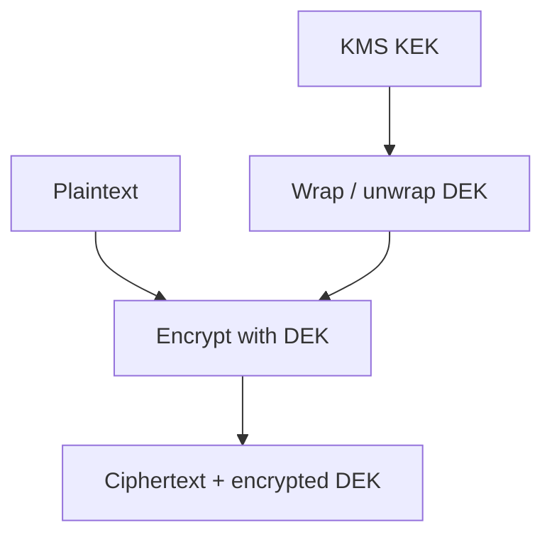

# 11 — Encryption, secrets, and key management

Previous: [Identity, authorization, and tenant isolation](10-identity-authorization-and-tenant-isolation.md). Study time: 45–55 minutes including the exercise.

## Mental model

Encryption changes readable data into ciphertext using a key. It reduces what an attacker can learn from stolen storage or intercepted traffic, but it does not decide whether a legitimate application should access the data.

Separate five concerns:

1. **Data classification:** What needs protection, retention, deletion, or residency?
2. **Authorization:** Which principal may use which data or key?
3. **Cryptography:** Which approved algorithm protects confidentiality and integrity?
4. **Key lifecycle:** How are keys generated, stored, rotated, revoked, backed up, and destroyed?
5. **Secret lifecycle:** How do workloads obtain credentials without embedding or leaking them?

The governing rule is:

> **Encrypt sensitive data with authenticated, versioned keys; keep keys outside the data store; and prefer short-lived identity over stored credentials.**

Encryption at rest is not a complete defense when a compromised application can ask the key service to decrypt everything. Least privilege, isolation, rate limits, audit, and incident response remain essential.

## When to use each protection

| Mechanism | Protects against | Does not replace |
| --- | --- | --- |
| TLS in transit | Network interception and tampering | Endpoint authorization |
| Storage/service encryption | Lost disks, snapshots, or provider media | Application-level access control |
| Application or field encryption | Database readers/backups seeing selected plaintext | Secure key use and metadata protection |
| Tokenization | Reduces spread of sensitive values | Authorization to the token vault |
| Hashing | Detects change or derives a one-way representation | Encryption when original value is needed |
| Password hashing | Slows password guessing | MFA, session security, breach response |
| Digital signature/MAC | Authenticity and integrity | Confidentiality unless encryption is also used |

Passwords should be salted and processed with an approved password-hashing function such as Argon2id, scrypt, or an appropriately configured PBKDF2/bcrypt—not reversibly encrypted for routine login.

Checksums detect accidental corruption. An unkeyed checksum alone does not prove a malicious party did not replace both the file and checksum.

## Threat model before algorithm choice

State what you are defending against:

- network observer;
- stolen database snapshot or object-store bucket;
- malicious or compromised application workload;
- cloud/platform administrator;
- support or analytics user with excessive access;
- leaked logs, traces, prompts, backups, or crash dumps;
- compromised key-management administrator;
- ransomware or destructive insider;
- cross-tenant key misuse;
- future cryptographic deprecation.

Also state what remains exposed. Queryable metadata, object size, access patterns, timestamps, tenant identifiers, and indexes may reveal information even when payloads are encrypted.

Do not invent custom cryptography. Use maintained platform libraries and managed key services with approved modes.

## Encryption in transit

Use modern TLS for client-to-edge and service-to-service traffic across untrusted or shared networks. Validate certificate chains, hostname, expiration, and intended identity. Disabling verification converts encryption into an unauthenticated channel vulnerable to interception.

For internal services, workload identity and mutual TLS can authenticate both endpoints. mTLS proves a workload identity at a network connection; application authorization must still evaluate the originating user, tenant, action, and resource.

Decide where TLS terminates. If a gateway terminates TLS, protect the gateway-to-service hop according to the network and threat model. Never assume “inside the VPC” is automatically trusted.

Certificate lifecycle needs:

- automated issuance and renewal;
- short, bounded lifetimes;
- trusted root rotation;
- overlapping validity during rollout;
- monitoring before expiry;
- revocation or rapid replacement;
- no private keys in images or source repositories.

## Encryption at rest

Provider-managed storage encryption is a useful baseline for databases, disks, object stores, queues, logs, and backups. Customer-managed keys can add control over authorization, rotation, audit, and revocation.

Application-level encryption is useful when:

- a database operator should not see selected fields;
- tenant-specific key boundaries are required;
- backups or replicas cross trust boundaries;
- cryptographic erasure is part of a deletion design;
- sensitive values flow through shared infrastructure.

It adds costs: query and indexing limitations, larger ciphertext, key-service dependency, migration complexity, and fewer server-side operations.

Searchable encryption is specialized. Do not claim arbitrary secure search over encrypted data without naming the leakage and trust assumptions. Often the practical design is to encrypt sources, tightly protect a derived search index, minimize indexed sensitive fields, and enforce authorization before retrieval.

## Authenticated encryption

Use authenticated encryption with associated data (AEAD), such as AES-GCM or ChaCha20-Poly1305 as provided by a trusted library.

AEAD provides:

- confidentiality of plaintext;
- integrity/authenticity of ciphertext;
- optional binding of non-secret metadata as associated data.

Associated data can bind ciphertext to context without encrypting that context:

```text
tenant_id | resource_type | resource_id | field_name | schema_version
```

If ciphertext is copied to another tenant or field, decryption fails because the associated data differs.

Nonce requirements are algorithm-specific and critical. Reusing a nonce with the same key can destroy security for common modes. Let the approved library generate and manage nonces correctly. Store the nonce, algorithm identifier, key version, ciphertext, and authentication tag needed for decryption.

Never log plaintext, keys, nonces as secrets, or raw decryption failures containing sensitive values.

## Envelope encryption

Encrypt large data with a data-encryption key (DEK), then protect that DEK with a key-encryption key (KEK) held by a key-management service (KMS) or hardware security module (HSM).



A record can store:

```text
algorithm
key_reference
key_version
encrypted_dek
nonce
associated_data_version
ciphertext
authentication_tag
```

Benefits:

- KMS protects a smaller set of KEKs;
- data can be encrypted locally without sending every byte to KMS;
- rotating a KEK can rewrap DEKs without re-encrypting all payloads;
- per-object or per-batch DEKs reduce blast radius.

The workload must be authorized to unwrap only the needed DEKs. Do not grant a shared service unrestricted decrypt across all tenants unless the risk is explicitly accepted.

Cache plaintext DEKs only when necessary, in memory, for a short bounded lifetime, with strict process access. Caching improves resilience and latency but extends exposure after revocation.

## Key hierarchy and tenant boundaries

A conceptual hierarchy:

```text
root/provider trust
  -> environment KEK
      -> tenant KEK or tenant context
          -> per-object/per-version DEK
```

Not every tenant needs a dedicated physical KMS key. Options include:

| Model | Strength | Tradeoff |
| --- | --- | --- |
| Shared key plus tenant-bound associated data | Simple and economical | Larger blast radius |
| Key per tenant | Stronger isolation and tenant revocation | Key-count, policy, quota, and operational overhead |
| Dedicated account/project/HSM | Strongest administrative boundary | Highest cost and deployment complexity |
| Customer-managed/BYOK | Customer control and compliance fit | Availability, rotation, support, and offboarding complexity |

Make the boundary match tenant risk, contracts, residency, and operating scale.

A tenant ID in a key name is not isolation. KMS authorization and encryption context must prevent one workload from requesting another tenant’s decrypt operation.

## Key lifecycle

Track explicit states:

```text
PRE_ACTIVE -> ACTIVE -> DECRYPT_ONLY -> RETIRED -> DESTROYED
```

A safe rotation usually:

1. creates a new key version;
2. grants workloads encrypt/decrypt access during overlap;
3. starts encrypting all new data with the new version;
4. rewraps DEKs or re-encrypts data in bounded, resumable jobs;
5. verifies coverage and reads;
6. removes old encrypt permission;
7. retains old decrypt permission for required history;
8. retires and eventually destroys only after all dependencies and retention rules are satisfied.

Key version must travel with ciphertext. Do not assume “current key” can decrypt historical data.

Rotation frequency alone is not a security strategy. Rotate on policy, suspected compromise, algorithm change, ownership change, or risk—not merely to produce a metric. Test application behavior during rotation and rollback.

## Secret management and workload identity

A secret is sensitive configuration used to authenticate or authorize, such as an API key, database password, webhook signing secret, or private key.

Prefer eliminating stored secrets:

- workload identity/federation instead of cloud access keys;
- managed database identity instead of shared passwords;
- short-lived OAuth tokens instead of permanent API tokens;
- automatically issued certificates instead of copied private keys.

When a secret is unavoidable:

- store it in a managed secret service;
- separate by environment and workload;
- grant least-privilege read access;
- fetch at startup or just in time;
- keep it out of source, images, build arguments, tickets, prompts, and shell history;
- redact it from logs and traces;
- rotate automatically with overlap;
- audit reads and denied reads;
- maintain a tested emergency revocation process.

Environment variables are convenient but can leak through crash reports, process inspection, diagnostics, child processes, and support bundles. They are a delivery mechanism, not a secret manager.

## Zero-downtime secret rotation

Rotation fails when producers and consumers switch in the wrong order.

For a database credential:

1. create a new credential;
2. grant equivalent least-privilege access;
3. publish the new secret version;
4. make clients refresh connections and use it;
5. verify old-credential traffic reaches zero;
6. revoke the old credential;
7. monitor authentication errors and rollback signals.

For signing or verification keys, verifiers often need both old and new public keys during an overlap. Signers use the new private key while previously issued tokens remain valid under the old public key until their bounded expiry.

Never keep the old credential indefinitely “just in case.” Define overlap and revocation deadlines.

## Key-service availability and regional recovery

KMS and secret stores are dependencies. Define:

- request timeout and retry budget;
- regional key replication or multi-region key policy;
- what may use cached DEKs and for how long;
- behavior when new encryption is unavailable;
- behavior when decryption is unavailable;
- recovery access for backups;
- separation of production and disaster-recovery authority.

A safe degraded mode may allow already-running workers to finish with cached short-lived DEKs while rejecting new sensitive writes. Another workload may need to fail closed immediately.

Do not replicate ciphertext to a region that cannot lawfully or technically decrypt it if failover requires service there. Conversely, replicating keys everywhere weakens residency and compromise boundaries.

Backups require key backups or durable KMS references. A database restore is useless if its keys were destroyed or its old key policy cannot be reconstructed. Test the complete restore, including keys, identities, secrets, and application decryption.

## Deletion and cryptographic erasure

Destroying a key can make ciphertext unreadable, but cryptographic erasure is safe only when:

- all copies are encrypted exclusively under that key or descendant keys;
- no plaintext copies remain in caches, logs, exports, search indexes, or backups;
- DEKs are not wrapped by another surviving KEK;
- key replicas and escrow copies are included;
- retention/legal-hold rules permit destruction;
- the organization accepts irreversible loss.

Key destruction is a high-impact operation with approval, delay, inventory, audit, and recovery safeguards. It is not a substitute for tracking and deleting derived data.

## AI-system leakage paths

AI systems duplicate sensitive material into places teams may forget:

- prompt and response logs;
- traces and observability payloads;
- conversation memory and checkpoints;
- embeddings and vector indexes;
- evaluation and fine-tuning datasets;
- human-review tools;
- cache entries;
- dead-letter queues;
- third-party model providers;
- model outputs copied into tickets or chat.

A secret scanner is useful but cannot reliably identify every credential or PHI item. Minimize data before the model call, tokenize or redact where the task permits, use approved providers and regions, disable unnecessary retention, and enforce outbound tool/network policy.

Never put API keys in a system prompt or retrieval document. A prompt injection can cause the model to reveal any secret present in context. Tools should hold credentials outside the model and execute only authorized typed operations.

Embedding is not encryption. Similarity vectors can leak attributes and remain sensitive derived data.

## Construction example

A construction assistant stores contracts, invoices, payroll-related attachments, and ERP connector credentials.

- TLS protects user and service traffic.
- Object storage, databases, queues, search snapshots, and backups use managed at-rest encryption.
- Highly sensitive fields use application-level AEAD with tenant/resource associated data.
- Per-object DEKs are wrapped by tenant-scoped KEKs.
- Workloads receive short-lived identities; only the ERP connector can read the ERP secret.
- The model never receives the ERP token. It proposes a typed operation; the connector authorizes and signs the request.
- Secret rotation supports old/new overlap and connection refresh.
- Key and secret access produces a protected audit event tied to workload, tenant context, and operation.
- Backup restore exercises confirm historical key versions can decrypt recovered data.
- Tenant offboarding removes data and derived artifacts before approved key destruction.

A database administrator who exports ciphertext should not automatically receive KMS decrypt permission.

## Healthcare variation

PHI can exist in FHIR resources, scanned documents, clinical notes, prompts, embeddings, caches, audit data, and vendor payloads.

Use minimum-necessary data, approved regions and vendors, and documented key ownership. Separate duties so a database operator cannot also administer decryption keys without a controlled process. Record vendor and workload identity for decrypt-sensitive operations.

For particularly sensitive categories, field-level encryption or tokenization can narrow access, but it complicates clinical search and interoperability. Choose protection without preventing authorized care. Emergency access still requires authorization and audit; possession of a key is not a break-glass policy.

A health system must preserve readable records for required retention periods. Destroying a tenant key for convenience can conflict with medical-record retention or legal holds.

## Tradeoffs

| Choice | Benefit | Cost or risk |
| --- | --- | --- |
| Provider-managed key | Low operational burden | Less customer control |
| Customer-managed key | Policy, audit, and revocation control | Availability and lifecycle responsibility |
| Key per tenant | Stronger isolation | Key fleet, quota, and support complexity |
| Field encryption | Protects selected data from database readers | Query/index and migration limitations |
| Per-object DEK | Small blast radius and flexible rewrap | More metadata and key operations |
| Cached plaintext DEK | Lower latency and KMS dependency | Longer exposure after compromise/revocation |
| Frequent rotation | Limits some exposure and meets policy | Operational churn without fixing broad access |
| BYOK/customer revocation | Customer control | Accidental outage and offboarding complexity |
| Multi-region keys | Easier regional failover | Wider compromise and residency boundary |
| Tokenization | Reduces sensitive data spread | Vault dependency and detokenization controls |

Choose controls from the threat model and recovery needs, not from the phrase “military-grade encryption.”

## Failure modes

| Failure | Consequence | Response |
| --- | --- | --- |
| Encryption used without authorization | Compromised app decrypts everything | Least-privilege key policy and data authorization |
| Token signature valid but wrong audience | Credential accepted by wrong service | Full token validation |
| Nonce reused under one AEAD key | Confidentiality/integrity can fail | Approved library and nonce strategy |
| Ciphertext lacks associated tenant data | Cross-tenant substitution | Bind tenant/resource context as AAD |
| Key version not stored | Historical data cannot decrypt | Versioned ciphertext envelope |
| Key and data stored together with same access | Storage theft exposes both | Separate KMS/HSM and identities |
| Secret embedded in image or prompt | Long-lived leak and model disclosure | Managed secret delivery; no secrets in context |
| Rotation revokes old credential too early | Production outage | Overlap, observed cutover, bounded rollback |
| Old credential never revoked | Permanent attack path | Rotation deadline and usage monitoring |
| KMS throttling causes retry storm | Cascading outage | Local envelope crypto, caching policy, backoff, quotas |
| DR database restores but key does not | Unrecoverable ciphertext | End-to-end restore exercises |
| Key destroyed before retention ends | Irreversible compliance loss | Inventory, approval, legal hold, delay |
| Logs contain plaintext/keys | Secondary breach | Structured redaction and access controls |
| Embeddings treated as anonymous | Sensitive derived data leaks | Classify and protect vector stores |

## What to measure

Measure lifecycle and misuse signals:

- encrypted coverage by data class and storage system;
- TLS/certificate expiry, protocol failures, and verification errors;
- KMS encrypt/decrypt/unwrap rate, latency, errors, and throttling;
- decrypt operations by workload, tenant context, key, and region;
- denied or anomalous key/secret access;
- key age, state, version coverage, and pending retirement;
- ciphertext still dependent on retiring keys;
- secret age, owner, scope, last use, and rotation success;
- traffic using old credentials during overlap;
- plaintext/secret detection in repositories, images, logs, and prompts;
- failed authentication after rotation;
- backup restore and historical decryption success;
- key-destruction approvals, holds, and inventory reconciliation;
- AI provider requests by data class, region, and retention policy.

Do not export raw secret values into the telemetry used to monitor secrets.

## Interview prompt

> Design encryption, secrets, and key management for a multi-tenant construction assistant that stores contracts and invoices, calls an ERP, uses a hosted LLM, supports regional recovery, and must delete tenant data safely. Explain how the design changes for PHI-bearing clinical workflows.

Spend five minutes covering threat model, TLS, at-rest and field encryption, envelope keys, tenant boundaries, workload identity, rotation, failover, deletion, AI leakage paths, and audit.

## Worked answer

**One-line conclusion:** Use envelope encryption with tenant-bound context, keep keys and credentials behind least-privilege workload identity, and design rotation and recovery before encrypting production data.

“I would classify data and threats first. TLS with verified endpoint identity protects every external and service hop. Managed at-rest encryption covers databases, objects, queues, indexes, and backups; selected fields use application AEAD with tenant, resource, field, and schema bound as associated data. Each object gets a DEK wrapped by a tenant-scoped KEK in KMS, and the ciphertext envelope stores algorithm and key version. Workloads use short-lived platform identities, while unavoidable ERP credentials live in a managed secret store accessible only to the connector. The model never sees credentials. Rotation introduces a new version, moves writers, verifies readers, rewraps or migrates data, and revokes the old version after bounded overlap. Regional recovery includes legal key availability and tested restore of historical versions. Deletion tracks every plaintext and derived copy before controlled key destruction. I would monitor anomalous decrypts, old-key coverage, stale credential use, KMS saturation, leakage scans, and restore/decryption tests.”

## Practice lab

Design the key and secret hierarchy for:

1. database and backups;
2. tenant document objects;
3. encrypted invoice bank details;
4. vector/search indexes;
5. ERP credentials;
6. hosted-model requests;
7. disaster-recovery region.

Then trace these incidents:

- the ERP credential is found in a log;
- the current tenant KEK is suspected compromised;
- KMS is unavailable for 20 minutes;
- a database backup restores but references a retired key version;
- a tenant requests deletion while a legal hold exists.

For each, state what is revoked, what continues, what is re-encrypted or rewrapped, what the user sees, and what evidence proves recovery.

## References

- [NIST SP 800-57 Part 1 Rev. 5 — Recommendation for Key Management](https://csrc.nist.gov/pubs/sp/800/57/pt1/r5/final)
- [NIST SP 800-52 Rev. 2 — Guidelines for TLS Implementations](https://csrc.nist.gov/pubs/sp/800/52/r2/final)
- [OWASP Cryptographic Storage Cheat Sheet](https://cheatsheetseries.owasp.org/cheatsheets/Cryptographic_Storage_Cheat_Sheet.html)
- [OWASP Secrets Management Cheat Sheet](https://cheatsheetseries.owasp.org/cheatsheets/Secrets_Management_Cheat_Sheet.html)
- [AWS KMS Cryptographic Details — Envelope encryption](https://docs.aws.amazon.com/kms/latest/cryptographic-details/envelope-encryption.html)
- [Google Cloud KMS documentation — Envelope encryption](https://cloud.google.com/kms/docs/envelope-encryption)
