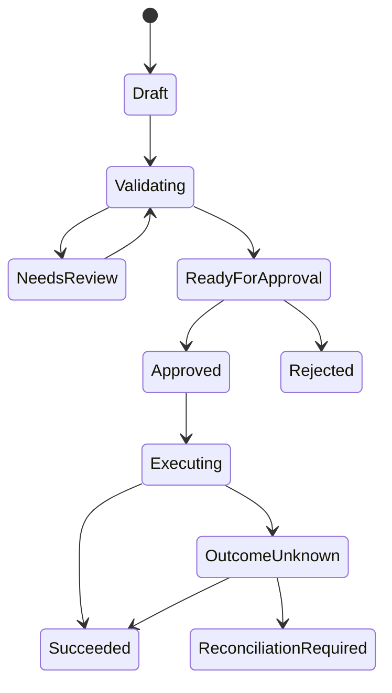

# 12 — Agent architecture, workflow state, and tool boundaries

Previous: [Encryption, secrets, and key management](11-encryption-secrets-and-key-management.md). Study time: 50–60 minutes including the exercise.

## Mental model

An agent is not “an LLM with every credential.” It is a controlled system in which a model proposes the next step while deterministic software owns identity, policy, state, tool execution, budgets, and recovery.

Separate the system into five layers:

1. **Experience:** API or user interface, streaming, status, and confirmation.
2. **Orchestration:** workflow state machine, checkpoints, deadlines, retries, and routing.
3. **Intelligence:** model calls, retrieval, classification, planning, and synthesis.
4. **Tools:** typed adapters for databases, SaaS APIs, search, files, and actions.
5. **Control:** authorization, tenant isolation, approvals, budgets, observability, and evaluation.

The key boundary is:

> **The model may propose; deterministic code validates, authorizes, records, and executes.**

A model response is untrusted input even when it was generated from a system prompt. It can be incorrect, malformed, manipulated by retrieved content, or inconsistent across retries.

## When to use an agent, workflow, or ordinary code

| Pattern | Use when | Main risk |
| --- | --- | --- |
| Deterministic code | Steps and rules are known | Hard to handle genuinely ambiguous language |
| Fixed workflow with model steps | Process is known; some steps require extraction, classification, or drafting | Model errors inside an otherwise predictable path |
| Router | One model decision selects among bounded workflows | Wrong route; needs fallback |
| Agent loop | The next step cannot be fully known in advance and exploration adds value | Unbounded cost, loops, unsafe actions |
| Human-led copilot | Consequences are high and model output is advisory | Human overload or automation bias |

Default to the least autonomous pattern that solves the user problem.

Invoice approval is primarily a workflow: ingest, extract, validate, match, propose, approve, post, reconcile. A model may classify a cost code or explain an exception, but the business transition should not depend on an open-ended agent inventing steps.

An exploratory investigation—“Find why project margin changed and gather supporting records”—may justify a bounded agent over read-only tools.

## Start from the business state machine

Define product states before prompts:



The durable state machine answers:

- what has definitely happened;
- what may happen next;
- which transitions require a human;
- which transition is retryable;
- which external outcome is uncertain;
- which terminal states exist.

Do not use chat history as the source of truth for business state. The model can summarize a conversation, but an invoice is approved only when the authoritative transaction records that transition.

## Durable workflow state

A workflow record can include:

```text
workflow_id
tenant_id
workflow_type
workflow_version
business_resource_id
current_state
state_version
created_by
authorization_snapshot_or_policy_version
deadline
attempt_budget
token_and_cost_budget
input_refs
artifact_refs
pending_approval_id
last_checkpoint
error_class
created_at / updated_at
```

Every transition uses optimistic concurrency or another compare-and-set mechanism:

```sql
UPDATE workflows
SET current_state = :next_state,
    state_version = state_version + 1
WHERE tenant_id = :tenant_id
  AND workflow_id = :workflow_id
  AND current_state = :expected_state
  AND state_version = :expected_version;
```

This prevents two workers or retries from silently advancing incompatible branches.

Persist large documents and model artifacts in object storage; keep references and hashes in workflow state. Avoid serializing secrets, raw credentials, or unnecessary PHI into checkpoints.

## Checkpointing and replay

Checkpoint after a durable, meaningful step—not after every token.

A checkpoint should contain enough information to resume safely:

- immutable input references and versions;
- current workflow state and version;
- completed step IDs;
- model, prompt, policy, retrieval, and tool schema versions;
- tool-call request and durable result reference;
- remaining budgets and deadline;
- approval state;
- error or uncertainty status.

Replay must distinguish pure computation from side effects.

| Step | Replay behavior |
| --- | --- |
| Classification over immutable input | Safe to recompute or reuse cached versioned result |
| Retrieval | Recompute when freshness matters; store evidence used for audit |
| Draft generation | Usually safe to regenerate; output may differ |
| Database state transition | Use idempotency key and guarded write |
| Email/ERP/payment action | Never blindly replay; query outcome or reconcile |
| Human approval | Reuse only if exact plan and relevant resource versions match |

A checkpoint is not proof that a side effect succeeded. Store external operation IDs and explicit `OUTCOME_UNKNOWN` when the boundary cannot confirm the result.

## Planning versus execution

Keep plans structured and bounded:

```json
{
  "goal": "explain invoice variance",
  "steps": [
    {"tool": "get_invoice", "args": {"invoice_id": "inv_123"}},
    {"tool": "get_budget_line", "args": {"cost_code": "03-3000"}},
    {"tool": "compare_values", "args": {}}
  ],
  "stop_conditions": ["evidence_sufficient", "budget_exhausted"],
  "requires_approval": false
}
```

Validate the plan before execution:

- only allowed tools appear;
- arguments match schemas;
- referenced resources belong to the active tenant;
- dependencies and ordering are valid;
- step count, cost, and time fit budgets;
- write steps have approval and idempotency requirements;
- no model-generated URL, SQL, or code bypasses policy.

For high-risk actions, do not let the model both define the policy and declare that it passed.

## Tool contracts

Each tool is a narrow application capability, not a raw infrastructure handle.

A tool contract should define:

- stable name and version;
- typed input schema;
- typed success and error outputs;
- read or write classification;
- authorization rule;
- tenant/resource binding;
- timeout and retry policy;
- idempotency behavior;
- rate and concurrency limits;
- maximum response size;
- data sensitivity;
- audit fields;
- compensation or reconciliation path.

Prefer:

```text
approve_invoice(invoice_id, expected_version, operation_id)
```

over:

```text
execute_sql(query)
```

Prefer:

```text
fetch_project_document(document_id, version_id)
```

over:

```text
http_get(url)
```

Narrow tools make policy, testing, and observability possible. Generic tools move uncontrolled authority into prompts.

## Tool-call execution boundary

A safe executor:

1. parses the structured call;
2. rejects unknown fields and invalid types;
3. binds trusted user, tenant, workflow, and trace context;
4. authorizes the tool and exact resource;
5. validates current resource state and version;
6. checks approval, budget, deadline, and rate limits;
7. creates or reuses an idempotent operation;
8. invokes the adapter with a scoped workload identity;
9. normalizes the result and classifies errors;
10. stores durable outcome and audit data;
11. returns bounded data to the model.

The model never receives the ERP credential. The adapter owns it. The model never chooses the active tenant. The server does.

Tool output is also untrusted. A document, webpage, vendor error, or database text may contain prompt injection. Encode it as data, constrain its size, and never reinterpret it as higher-priority instruction.

## Read tools versus write tools

Separate read and write capabilities.

Read tools can still leak sensitive data or create denial-of-service, so they need authorization and quotas. Write tools additionally need:

- preview of exact effect;
- guarded resource version;
- stable operation ID;
- human approval when required;
- separation of duties;
- explicit outcome states;
- reconciliation after uncertainty.

A common safe progression is:

1. read-only assistant;
2. draft/propose mode;
3. user-confirmed low-risk actions;
4. approved bounded workflows;
5. limited autonomous actions with proven controls.

Autonomy is earned through evidence, not enabled by changing one configuration flag.

## Human approval

Approval binds to an immutable action plan:

```text
approval_id
tenant_id
workflow_id
plan_hash
resource_versions
tool_name_and_version
normalized_arguments
requested_by
approved_by
policy_version
expires_at
status
```

Before execution:

- recompute and compare the plan hash;
- verify resources have not changed;
- recheck current authorization according to policy;
- confirm approval has not expired or been revoked;
- enforce separation of duties;
- show the executor exactly what is authorized.

If any material input changes, request approval again. “Approve this invoice” cannot silently become “approve this invoice with a different amount or bank account.”

## Memory and context

Separate memory types:

| Memory | Purpose | Storage rule |
| --- | --- | --- |
| Working context | Current turn evidence and instructions | Bounded, ephemeral, tenant-scoped |
| Workflow state | Durable progress and operation status | Authoritative database/checkpoints |
| Episodic history | Prior interactions useful for continuity | Consent, retention, deletion, provenance |
| Semantic memory | Extracted stable facts | Verify source, freshness, confidence, tenant |
| Procedural memory | Approved instructions or playbooks | Versioned and reviewed, not learned silently |

Do not write every model statement into long-term memory. Candidate memories need provenance, type, ownership, confidence, expiry, and validation. A user correction should not overwrite authoritative ERP or clinical data.

Conversation history is not equivalent to current authorization. Recheck access before retrieving or reusing old content.

## Budgets and stop conditions

Every run needs hard limits:

- wall-clock deadline;
- maximum model calls;
- maximum tool calls;
- token and monetary budget;
- retry budget;
- maximum retrieved bytes/documents;
- recursion or graph depth;
- maximum consecutive no-progress steps.

Stop on:

- goal satisfied with evidence;
- required information missing;
- human approval needed;
- policy denial;
- uncertainty at an external side effect;
- deadline or budget exhausted;
- repeated identical action or no progress;
- unsafe or unsupported request.

Return a truthful partial status rather than hiding termination behind a confident final answer.

## Retry and error taxonomy

Classify errors:

| Error | Example | Response |
| --- | --- | --- |
| Invalid model output | Schema mismatch | One bounded repair/re-prompt, then fail |
| Policy denial | User cannot access project | Do not retry |
| Business conflict | Invoice version changed | Refresh state; require new plan/approval |
| Transient dependency | Rate limit or short outage | Backoff with jitter within budget |
| Permanent dependency | Unknown resource or invalid input | Surface correction path |
| Outcome unknown | ERP timeout after request sent | Reconcile by stable operation ID |
| Model quality failure | Unsupported claim or missing citation | Retrieve again within budget or abstain |

Do not retry the entire agent graph when only one safe step failed. Whole-run retry can duplicate prior side effects and waste budget.

## Determinism and nondeterminism

Models are probabilistic, but the surrounding system can be deterministic where correctness matters.

Record:

- model/provider/version;
- prompt and tool-schema versions;
- sampling settings;
- retrieval query and source versions;
- structured model output;
- validation and policy results;
- tool operation IDs and normalized outcomes;
- final evidence/citations.

Even with identical inputs, a provider may not reproduce identical output. Store the evidence needed to explain the action rather than promising perfect replay.

Use deterministic code for arithmetic, threshold checks, date calculations, permissions, state transitions, and financial totals. Ask the model to interpret or explain, not to be the only calculator or policy engine.

## Prompt injection and data boundaries

Treat these as untrusted:

- user messages;
- retrieved documents;
- emails and attachments;
- webpages and vendor responses;
- OCR text;
- prior model output;
- tool error strings.

Controls include:

- clear separation of system policy and data;
- typed, allowlisted tools;
- least-privilege identities and network egress;
- authorization outside the model;
- content-size and file limits;
- secrets kept out of context;
- approval for consequential actions;
- detection/evaluation of injection patterns;
- safe rendering and citation of sources.

Prompt filtering alone is not a security boundary. Assume some malicious instruction reaches the model and ensure it still cannot gain authority.

## Construction example

A project manager asks:

> “Review this invoice, compare it with the contract and approved change orders, and prepare it for approval.”

The workflow:

1. authenticates the manager and resolves tenant/project access;
2. creates a durable `INVOICE_REVIEW` workflow with budgets;
3. retrieves the immutable invoice, contract, purchase order, and current change orders;
4. uses deterministic parsers for amounts and identifiers;
5. uses the model to classify line items and explain discrepancies with citations;
6. runs deterministic totals and tolerance checks;
7. stores a proposed coding/approval plan with resource versions;
8. routes exceptions or low-confidence fields to human review;
9. presents an exact preview and obtains an approval bound to the plan hash;
10. rechecks authorization and versions;
11. submits to the ERP with a stable operation ID;
12. records success, failure, or outcome unknown and reconciles as needed.

If the contract changes after approval, execution pauses and invalidates the approval. The agent does not “reason around” the mismatch.

## Healthcare variation

A discharge-planning assistant may summarize records, identify missing tasks, and draft follow-ups. It should not autonomously change medication, place an order, or contact a patient without the clinical workflow’s authorization and approval.

Workflow state identifies patient, encounter, authorized purpose, evidence versions, model/tool versions, and accountable clinician. Retrieval is patient-scoped before model context. High-risk recommendations cite current sources and distinguish preliminary, corrected, and final results.

Clinical tools remain narrow: `get_current_medication_list` is safer than generic FHIR query access; `draft_followup_task` is safer than immediately sending instructions. Emergency access, consent, and treatment relationship are enforced outside the model and audited.

## Tradeoffs

| Choice | Benefit | Cost or risk |
| --- | --- | --- |
| Fixed workflow | Predictable and testable | Less flexible for ambiguous tasks |
| Open agent loop | Flexible exploration | Cost, loops, safety, and debugging difficulty |
| Fine-grained checkpoints | Less recomputation | More storage and versioning complexity |
| Recompute model steps | Fresh context | Nondeterminism and cost |
| Reuse stored output | Stable audit | May be stale under changed evidence |
| Narrow tools | Strong policy and observability | More adapter development |
| Generic tools | Rapid prototyping | Large authority and attack surface |
| Human approval | Controls consequential actions | Latency and reviewer load |
| More context | Potential recall | Cost, distraction, leakage, prompt injection |
| Long-term memory | Personalization and continuity | Staleness, privacy, poisoning, deletion burden |

Do not add agent autonomy where a queue and state machine solve the problem more reliably.

## Failure modes

| Failure | Consequence | Response |
| --- | --- | --- |
| Chat history is workflow state | Restart loses or corrupts progress | Durable versioned state machine |
| Whole graph retries after timeout | Duplicate external actions | Step checkpoints and idempotent operations |
| Model receives broad credentials | Prompt injection can use them | Credentials stay in scoped adapters |
| Generic SQL/HTTP tool | Data exfiltration or destructive action | Narrow typed domain tools |
| Approval not bound to plan | Executed action differs from preview | Plan hash, versions, expiry |
| Tool output treated as instruction | Indirect prompt injection | Mark as data; policy hierarchy and typed parsing |
| Agent loops without progress | Cost and latency runaway | Budgets and repeated-state detector |
| Model computes financial totals | Silent arithmetic error | Deterministic calculator and validation |
| Old checkpoint resumes under new schema | Invalid or unsafe transition | Workflow/prompt/tool version migration |
| Worker loses response after ERP accepts | Outcome mistaken for failure | `OUTCOME_UNKNOWN` and reconciliation |
| Memory stores unsupported claim | Future answers repeat error | Provenance, confidence, validation, expiry |
| Authorization checked only at start | Revoked user’s action executes later | Execution-time policy and approval rules |
| Model/provider change silently | Quality regression and untraceable behavior | Version pinning, evaluation, controlled rollout |

## What to measure

Measure the workflow, model, and tools separately:

- completion, abstention, escalation, and abandonment rates;
- state duration and oldest workflow in each state;
- model/tool calls, tokens, cost, and wall-clock time per run;
- budget exhaustion and loop/no-progress stops;
- schema-validation and repair rates;
- tool success, denial, timeout, duplicate, and outcome-unknown rates;
- approval request, modification, rejection, expiry, and execution rates;
- citation coverage and evidence-version correctness;
- human correction by field and reason;
- authorization revocation caught before execution;
- checkpoint resume success and replay duplication incidents;
- quality metrics segmented by workflow, tenant type, document type, model, prompt, and tool versions;
- incidents where a model output crossed a deterministic control boundary.

High workflow completion with frequent human correction is not automation success.

## Interview prompt

> Design an AI agent that reviews construction invoices against contracts and change orders, proposes cost codes, obtains approval, and submits approved invoices to an ERP. The process can last hours, models and workers may fail, permissions can change, and the ERP can accept a request even when your system times out. Adapt the design for a clinical discharge-planning assistant.

Spend five minutes covering agent versus workflow, durable state, checkpoints, tools, authorization, approval, idempotency, budgets, memory, prompt injection, observability, and evaluation.

## Worked answer

**One-line conclusion:** Put the model inside a durable state machine, expose only narrow authorized tools, and bind every side effect to versioned state, approval, and an idempotent operation.

“I would implement invoice review as a deterministic workflow with model-assisted steps, not an unrestricted loop. A tenant-scoped workflow record stores state/version, immutable input references, budgets, policy version, completed steps, evidence, and pending approval. Parsers and code compute identifiers, totals, and thresholds; the model classifies and explains discrepancies with citations. Tool calls use strict schemas. An executor binds trusted user and tenant context, authorizes the exact resource, checks deadlines and budgets, then invokes a scoped adapter. The model never sees credentials. The proposed ERP action includes exact arguments and resource versions; human approval stores its hash, approver, policy, and expiry. Execution rechecks authorization and versions and uses a stable operation ID. Each durable step checkpoints independently, so retries do not replay completed side effects. An ERP timeout becomes outcome unknown and triggers reconciliation. I would cap calls, tokens, time, and recursion, then measure stage-level quality, corrections, denials, duplicates, uncertain outcomes, cost, and completion.”

## Practice lab

Design the workflow state and tool contracts for:

1. read invoice and contract;
2. retrieve approved change orders;
3. extract and validate totals;
4. propose cost codes;
5. request human review;
6. submit to ERP;
7. reconcile an uncertain ERP outcome.

Then trace this incident:

- the controller approves plan version 7;
- a change order arrives and changes the allowable amount;
- the worker restarts from a checkpoint;
- the model tries to submit the old plan;
- the ERP times out after possibly accepting it.

Explain which checks stop the stale plan, when approval is invalidated, which operation ID is reused, what state the user sees, and how the final outcome is established.

## References

- [NIST AI RMF Generative AI Profile](https://www.nist.gov/publications/artificial-intelligence-risk-management-framework-generative-artificial-intelligence)
- [OWASP Top 10 for Large Language Model Applications](https://genai.owasp.org/llm-top-10/)
- [MITRE ATLAS — Adversarial Threat Landscape for AI Systems](https://atlas.mitre.org/)
- [Temporal documentation — Durable execution](https://docs.temporal.io/)
- [LangGraph documentation — Persistence](https://docs.langchain.com/oss/python/langgraph/persistence)
