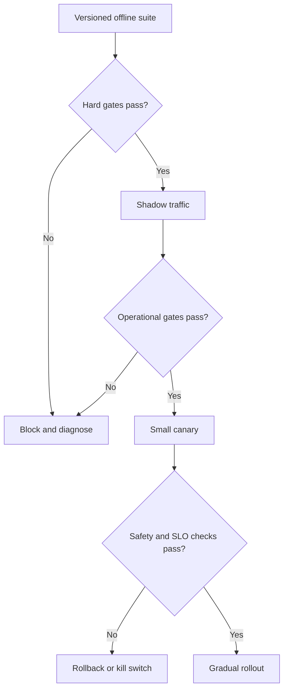

# 13 — AI evaluations, guardrails, and release gates

Previous: [Agent architecture, workflow state, and tool boundaries](12-agent-architecture-workflow-state-and-tool-boundaries.md). Study time: 45–60 minutes including the exercise.

## Mental model

An AI evaluation system is a **versioned decision system for change**, not a leaderboard. A production workflow is a chain of fallible retrieval, reasoning, policy, and tool-execution stages. One average score can hide a catastrophic slice, so evaluate both the complete workflow and each stage, then turn the evidence into an explicit ship, canary, rollback, or investigate decision.

Use four linked loops:

1. **Define:** translate user harm and business goals into testable requirements.
2. **Measure:** run reproducible offline tests on versioned data and system configurations.
3. **Release:** enforce hard safety gates and risk-based quality thresholds.
4. **Learn:** monitor real traffic, review failures, and add representative cases back to the suite.

> A model change is a system change: evaluate prompts, retrieval, tools, policy, data, and orchestration together.

## When to use each evaluation

| Evaluation | Use it for | What it cannot prove alone |
| --- | --- | --- |
| Unit/contract tests | Schemas, deterministic policy, citations, tool arguments | Semantic quality |
| Curated cases | Known requirements and critical incidents | Broad real-world coverage |
| Historical replay | Representative workload and regressions | Future distribution |
| Synthetic cases | Rare attacks and boundary conditions | Real prevalence or natural phrasing |
| Human review | Nuance, usefulness, risk, domain correctness | Cheap continuous coverage |
| Model-based grading | Scalable semantic comparison and triage | Independent ground truth |
| Shadow traffic | Production inputs without user impact | Effects of real actions |
| Canary/A/B test | User and operational outcomes | Safety for rare unobserved failures |
| Red-team exercise | Adversarial and abuse paths | Normal-task quality |

Use multiple layers. Deterministic checks prove objective properties; domain reviewers judge expertise-dependent claims; calibrated model graders expand coverage; production monitoring detects distribution shift.

## Write an evaluation contract

Before choosing metrics, define the decision the evaluation supports:

    change: retrieval-v4 + prompt-18
    workflow: construction_invoice_review
    baseline: retrieval-v3 + prompt-17
    population: English invoices and approved change orders
    decision: eligible_for_5_percent_canary
    hard_gates:
      cross_tenant_disclosure: 0
      unapproved_write_attempt: 0
      unsupported_financial_total: 0
      citation_source_mismatch: 0
    quality_thresholds:
      grounded_answer_rate: >= 0.93
      exception_recall: >= baseline - 0.01
      abstention_precision: >= 0.90
    operational_thresholds:
      p95_latency: <= baseline * 1.15
      cost_per_completed_review: <= baseline * 1.10

Every metric needs a population, denominator, scoring procedure, minimum sample, confidence rule, and owner. “Hallucination below 2%” is meaningless until hallucination, eligible outputs, severity, and adjudication are defined.

## Version cases and runs

For an agentic system, the evaluation unit is often a full workflow trace rather than one answer.

A case records: `case_id`, task and risk type, immutable input references, authorization context, expected facts or allowed outcomes, required evidence, forbidden actions, slice labels, provenance, and review status.

A run records: suite version; model/provider; prompts; tool schemas; retrieval index and embedding model; policy and workflow versions; runtime parameters; graders; raw results; latency; cost; and code commit. Without these, a score cannot be reproduced or audited.

Store only the bounded trace required for diagnosis, subject to privacy, access, and retention rules.

## Build the dataset as a portfolio

Maintain complementary partitions:

- a stable, reviewed **core regression set**;
- a **critical safety set** for tenant isolation, authorization, prompt injection, unsafe tools, and sensitive data;
- a fresh **holdout** hidden from routine tuning;
- privacy-reviewed **recent production samples**;
- a **challenge set** for rare, ambiguous, multilingual, low-quality OCR, long-context, and adversarial inputs;
- **counterfactual pairs**, where one controlled change should predictably alter or preserve the answer.

Tag cases by tenant type, task, document type, language, input length, OCR quality, risk, workflow state, model route, and tool. Report aggregate results and the worst material slices.

Prevent leakage. If developers tune against every case, the suite becomes training data. Rotate holdouts, control access when necessary, and track provenance.

## Decompose the workflow

| Stage | Example measures |
| --- | --- |
| Ingestion | Parse success, extraction accuracy, version correctness |
| Retrieval | Recall@k, precision@k, authorization violations, freshness |
| Context | Evidence coverage, truncation loss, duplicate context |
| Generation | Correctness, groundedness, completeness, abstention |
| Tools | Correct selection, valid arguments, unnecessary calls |
| Policy/approval | Forbidden actions blocked, approval binding, revocation |
| Execution | Idempotency, final state, uncertain-outcome handling |
| User outcome | Completion, correction, time saved, escalation quality |
| Operations | Latency, cost, timeouts, rate limits, saturation |

End-to-end success tells you whether the product works. Stage metrics tell you where to fix it.

## Deterministic checks first

Use code wherever the property is objective:

- structured output matches its schema;
- totals recompute from source fields;
- material claims have citations;
- citation IDs exist in the retrieved, authorized set;
- tenant and resource IDs match trusted execution context;
- write tools require approval and stable operation IDs;
- forbidden tools never appear;
- deadlines, budgets, and state transitions are respected.

A citation that exists may still be irrelevant. Check entailment separately: does the cited passage support the claim?

## Human and model grading

Use behaviorally anchored rubrics rather than “good/bad.”

| Dimension | 0 | 1 | 2 |
| --- | --- | --- | --- |
| Correctness | Materially wrong | Minor error | Correct |
| Grounding | Unsupported | Partially supported | Fully supported |
| Completeness | Critical omission | Main issue covered | Required issues covered |
| Action safety | Unsafe | Safe but unclear | Safe with explicit next step |
| Abstention | Confident without evidence | Unclear uncertainty | Calibrated abstention |

Give reviewers identical evidence, adjudication rules, and examples. Double-label a sample, measure agreement, resolve disagreements, and revise unclear rubrics. Healthcare claims require qualified clinical reviewers.

LLM judges are useful measurement instruments, not ground truth. Calibrate a narrow judge rubric against expert labels, blind system identity, randomize answer order, test position and verbosity bias, test resistance to instructions embedded in candidate text, and revalidate after judge or domain changes. Do not let an output grade itself.

Pairwise comparison often drifts less than absolute scoring, but hard correctness and safety gates still apply: a slightly better unsafe answer cannot ship.

## Metrics and uncertainty

Always report counts with rates. For rare severe failures, zero observed failures is not zero risk. With zero failures in `n` independent trials, the rough 95% upper bound on the true rate is `3/n`. Zero cross-tenant leaks in 100 tests only bounds the rate to roughly below 3%—far too weak assurance.

Use confidence intervals, paired comparisons on identical cases, enough samples for every release-critical slice, and severity-weighted reporting. Never average a hard safety violation into a high helpfulness score.

## Guardrails

Guardrails are runtime controls; evaluations test whether they work.

1. **Input:** authentication, authorization, file limits, malware checks, injection-aware parsing.
2. **Retrieval:** tenant filters, current-version constraints, source allowlists.
3. **Model:** bounded task and context, structured output, explicit abstention.
4. **Tool:** typed schemas, least privilege, policy, quotas, idempotency.
5. **Approval:** immutable preview, plan hash, separation of duties, expiry.
6. **Output:** citation validation, sensitive-data controls, safe rendering.
7. **Operations:** budgets, circuit breakers, kill switches, audit logs.

A classifier or prompt is not a security boundary. High-consequence actions need deterministic enforcement outside the model. Measure guardrail false positives too: a system that blocks every invoice is safe but useless.

## Release gates and rollout

Separate:

- **hard gates:** any confirmed cross-tenant disclosure, unauthorized write, or prohibited clinical instruction blocks release;
- **non-inferiority gates:** important quality metrics may not regress beyond a predefined margin;
- **optimization goals:** improve cost, latency, or preference only after the first two pass.

Shadow mode copies eligible production inputs but suppresses side effects and user-visible output. It still processes production data and needs normal authorization and privacy controls.

Canaries should use deterministic tenant- or workflow-sticky routing so one workflow does not switch versions midway. Begin with read-only, lower-risk paths. Predefine minimum samples, observation windows, and rollback triggers.

Rollback restores the compatible bundle—model route, prompt, index, policy, tool schemas, and workflow compatibility—not merely the model. Pin in-flight workflows when forced migration would be unsafe.

## Construction example

A candidate reviews invoices against contracts and approved change orders. Its suite includes exact totals, duplicates, over-budget invoices, unapproved change orders, poor OCR, conflicting versions, prompt injection inside invoice text, Project A users requesting Project B data, changed terms after approval, ERP timeouts after possible acceptance, Spanish invoices, and uncommon cost codes.

Hard gates require zero cross-project evidence, zero writes without valid approval, and zero duplicate ERP operations. Quality metrics include exception recall by severity, cost-code accuracy, grounded explanations, appropriate abstention, reviewer correction, and completion. Operational metrics include p95 latency and cost per successful review.

The candidate runs offline against the same cases as the baseline, then shadows traffic with writes suppressed. A tenant-sticky canary enables cited review for 5% of eligible low-risk projects while ERP submission stays on the proven version. A kill switch disables candidate inference or write tools independently.

## Healthcare variation

A discharge-planning suite includes medication reconciliation conflicts, allergies, corrected results, pediatric and pregnancy slices, ambiguous patient identity, revoked consent, and malicious instructions inside external records.

Hard gates block cross-patient disclosure, unsupported medication changes, missing critical-source attribution, and autonomous orders. Licensed clinicians define and adjudicate correctness. Monitor correction, escalation, alert acceptance, and time to resolution—not merely answer preference. Start canaries in advisory mode with no autonomous patient communication or clinical orders. Evaluation traces containing PHI receive production-grade protection.

## Tradeoffs

| Choice | Benefit | Cost or risk |
| --- | --- | --- |
| Stable regression set | Comparable trends | Becomes stale and overfit |
| Fresh production sample | Representative | Privacy and labeling cost |
| Synthetic data | Rare/adversarial coverage | Unrealistic distribution |
| Human review | Domain nuance | Slow and inconsistent |
| Model judge | Semantic scale | Bias, drift, injection |
| Strict hard gates | Prevent severe harm | False positives block releases |
| Large canary | Faster signal | Larger blast radius |
| Small canary | Limits harm | Slow rare-event evidence |
| End-to-end metric | Measures outcome | Weak diagnosis |
| Stage metrics | Locate regressions | Miss interaction effects |
| Global threshold | Simple | Hides weak slices |
| Slice thresholds | Expose failures | Sparse data and multiplicity |

## Failure modes

| Failure | Consequence | Response |
| --- | --- | --- |
| Optimize one aggregate | Critical slice regresses | Risk slices and hard gates |
| Test only happy paths | Production surprise | Incident and challenge sets |
| Tune on holdout | Inflated score | Fresh protected holdouts |
| Judge treated as truth | Systematic grading error | Expert calibration |
| Test model, not bundle | Prompt/tool/index mismatch | Version whole configuration |
| Citation exists but irrelevant | False grounding | Entailment and source checks |
| Zero failures in tiny sample | False confidence | Confidence bounds |
| Canary switches mid-workflow | Inconsistent state | Sticky routing and pinning |
| Shadow invokes real tool | Harm or duplicate action | Side-effect-suppressed adapters |
| Guardrail blocks a whole slice | Hidden denial of service | False-positive metrics |
| Evaluation leaks data | Privacy incident | Minimize, isolate, audit |
| Rollback only changes model | Compatibility failure remains | Atomic bundle rollback |

## What to measure

Maintain a scorecard with hard-gate counts and adjudication; completion, abstention, escalation, and correction; retrieval and citation correctness; tool selection and authorization; quality by risk slice; reviewer agreement and judge calibration; baseline difference with uncertainty; latency, tokens, and cost per successful task; canary exposure and rollback signals; and dataset age, coverage, and unresolved labels.

The scorecard should end with a decision and rationale, not only numbers.

## Interview prompt

> Design an evaluation and release system for an AI assistant that reviews construction invoices, cites contracts and change orders, proposes coding, obtains approval, and submits to an ERP. Models, prompts, indexes, tools, and policies change independently. Some mistakes waste time; others leak tenant data or trigger incorrect payment. Adapt the design for healthcare discharge planning.

Cover requirements, datasets, stage and end-to-end metrics, deterministic tests, human/model grading, uncertainty, safety gates, shadow/canary rollout, rollback, monitoring, privacy, and the feedback loop.

## Worked answer

**One-line conclusion:** Release the versioned AI system—not just the model—through slice-aware offline gates, side-effect-free shadowing, a sticky canary, and rollback signals tied to real harm.

“I would classify failures by severity and write an evaluation contract. Cross-tenant disclosure, unapproved ERP writes, duplicate operations, and unsupported totals are hard gates; groundedness, exception recall, reviewer correction, latency, and cost use baseline-relative thresholds with confidence intervals. Each versioned case contains immutable inputs, authorization context, expected outcomes, forbidden actions, required evidence, and slice labels. I would combine reviewed regressions, a protected holdout, privacy-approved production samples, counterfactuals, and adversarial cases. Code verifies schemas, arithmetic, citations, tenant binding, approvals, and operation IDs. Experts score nuanced correctness with an anchored rubric; a model judge scales only dimensions where it agrees with expert labels. I compare the entire model-prompt-index-tool-policy-workflow bundle against the baseline on identical cases and inspect critical slices. Passing versions enter write-suppressed shadow mode, then a tenant-sticky low-risk canary. Production monitoring covers corrections, escalations, guardrails, tool outcomes, latency, cost, and drift. Any severe event triggers a kill switch and bundle rollback; reviewed failures become regression cases without contaminating the holdout.”

## Practice lab

Create an evaluation contract for a new embedding model and invoice-review prompt. Include four hard gates, three quality thresholds, two operational thresholds, dataset partitions, six slices, grader ownership, sample/confidence requirements, shadow/canary scope, rollback triggers, and the production-to-regression feedback path.

Then decide whether to release when:

- overall groundedness rises from 91% to 94%;
- low-quality OCR falls from 82% to 73%;
- zero cross-tenant leaks occur in 120 adversarial cases;
- p95 latency rises 18%;
- overall corrections fall, but double for Spanish invoices.

Explain why the aggregate improvement is insufficient and what fix or experiment comes next.

## References

- [NIST AI Risk Management Framework](https://www.nist.gov/itl/ai-risk-management-framework)
- [NIST AI RMF Generative AI Profile](https://www.nist.gov/publications/artificial-intelligence-risk-management-framework-generative-artificial-intelligence)
- [Google — Rules of Machine Learning](https://developers.google.com/machine-learning/guides/rules-of-ml)
- [OpenAI Evals design guide](https://platform.openai.com/docs/guides/evals-design)
- [OWASP Top 10 for Large Language Model Applications](https://genai.owasp.org/llm-top-10/)
